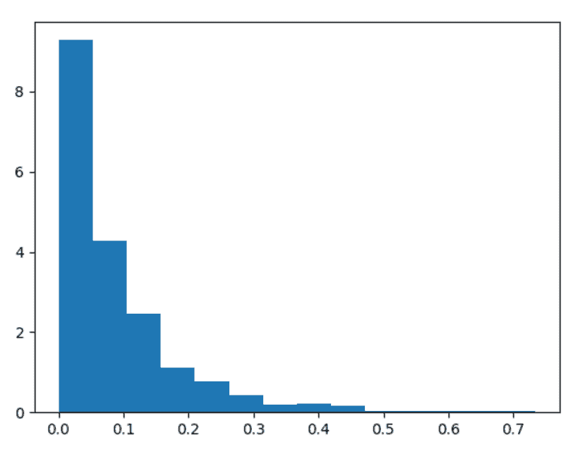
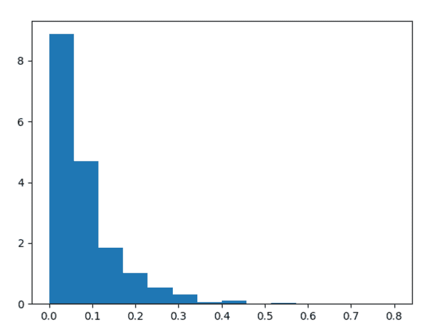

# Python 中的 numpy.random.pareto()

> 原文:[https://www . geesforgeks . org/numpy-random-Pareto-in-python/](https://www.geeksforgeeks.org/numpy-random-pareto-in-python/)

借助 **numpy.random.pareto()** 方法，我们可以从具有特定形状的 Pareto II 或 Lomax 分布中获得随机样本，并使用该方法返回随机样本。


洛马克斯分布

> **语法:** numpy.random.pareto(a，size=None)
> 
> **返回:**返回随机样本。

**示例#1 :**

在这个例子中我们可以看到，通过使用 **numpy.random.pareto()** 方法，我们能够从 pareto 或 Lomax 分布中获得随机样本，并使用该方法返回随机样本。

## 蟒蛇 3

```py
# import numpy
import numpy as np
import matplotlib.pyplot as plt

# Using numpy.random.pareto() method
gfg = np.random.pareto(12.45, 1000)

count, bins, ignored = plt.hist(gfg, 14, density = True)
plt.show()
```

**输出:**

> 

**例 2 :**

## 蟒蛇 3

```py
# import numpy
import numpy as np
import matplotlib.pyplot as plt

# Using numpy.random.pareto() method
gfg = np.random.pareto(13.89, 1000)

count, bins, ignored = plt.hist(gfg, 14, density = True)
plt.show()
```

**输出:**

> 