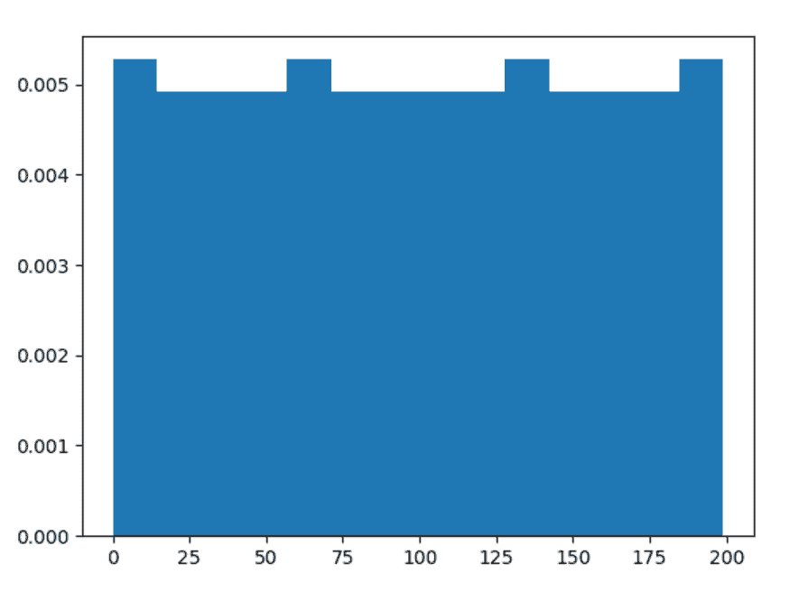
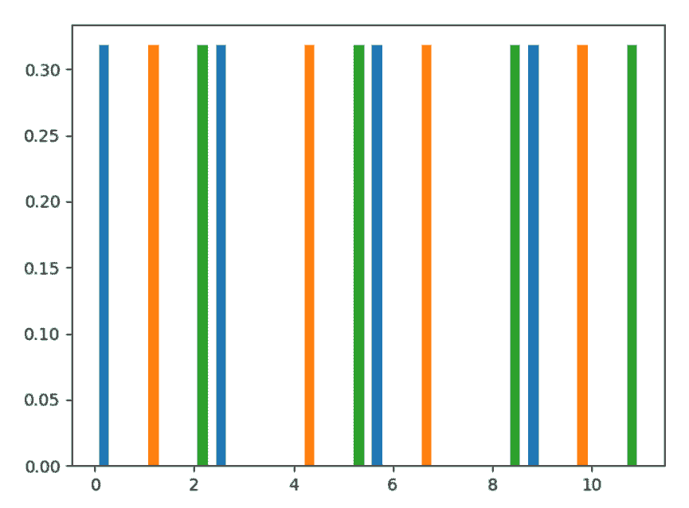

# Python 中的 numpy . random . arrange()

> 原文:[https://www . geesforgeks . org/numpy-随机-python 中的排列/](https://www.geeksforgeeks.org/numpy-random-permutation-in-python/)

借助于**numpy . random . replacement()**方法，利用该方法可以得到置换序列和返回序列的随机样本。

> **语法:** numpy.random .置换(x)
> 
> **返回:**返回置换值的随机序列。

**示例#1 :**

在这个例子中我们可以看到，通过使用**numpy . random . replacement()**方法，我们能够得到置换的序列，并且它将使用这个方法返回序列。

## 蟒蛇 3

```py
# import numpy
import numpy as np
import matplotlib.pyplot as plt

# Using permutation() method
gfg = np.random.permutation(200)

count, bins, ignored = plt.hist(gfg, 14, density = True)
plt.show()
```

**输出:**

> 

**例 2 :**

## 蟒蛇 3

```py
# import numpy
import numpy as np
import matplotlib.pyplot as plt

arr = np.arange(12).reshape((4, 3))
# Using permutation() method
gfg = np.random.permutation(arr)

count, bins, ignored = plt.hist(gfg, 14, density = True)
plt.show()
```

**输出:**

> 