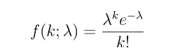
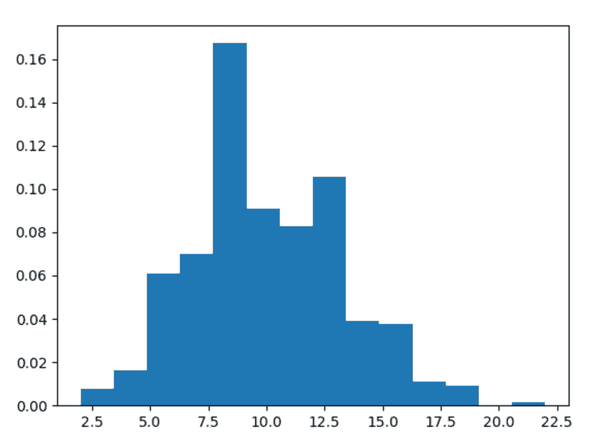
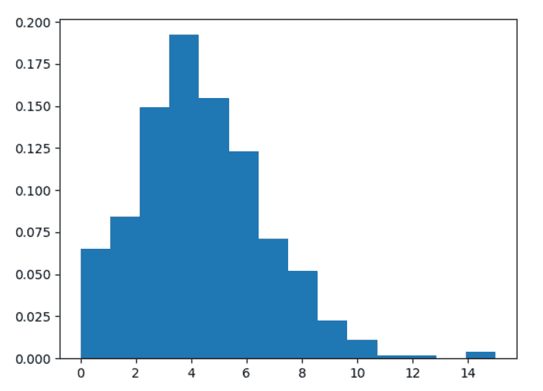

# Python 中的 numpy.random.poisson()

> 原文:[https://www . geesforgeks . org/numpy-random-poisson-in-python/](https://www.geeksforgeeks.org/numpy-random-poisson-in-python/)

借助 **numpy.random.poisson()** 方法，我们可以从泊松分布中得到随机样本，并利用该方法返回随机样本。



泊松分布

> **语法:**numpy . random . poisson(lam = 1.0，size=None)
> 
> **返回:**将随机样本作为 numpy 数组返回。

**示例#1 :**

在这个例子中我们可以看到，通过使用这个 **numpy.random.poisson()** 方法，我们能够通过使用这个方法从泊松分布中获得随机样本。

## 蟒蛇 3

```
# import numpy
import numpy as np
import matplotlib.pyplot as plt

# Using poisson() method
gfg = np.random.poisson(10, 1000)

count, bins, ignored = plt.hist(gfg, 14, density = True)
plt.show()
```

**输出:**

> 

**例 2 :**

## 蟒蛇 3

```
# import numpy
import numpy as np
import matplotlib.pyplot as plt

# Using poisson() method
gfg = np.random.poisson(4.5, 500)

count, bins, ignored = plt.hist(gfg, 14, density = True)
plt.show()
```

**输出:**

> 