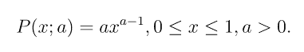
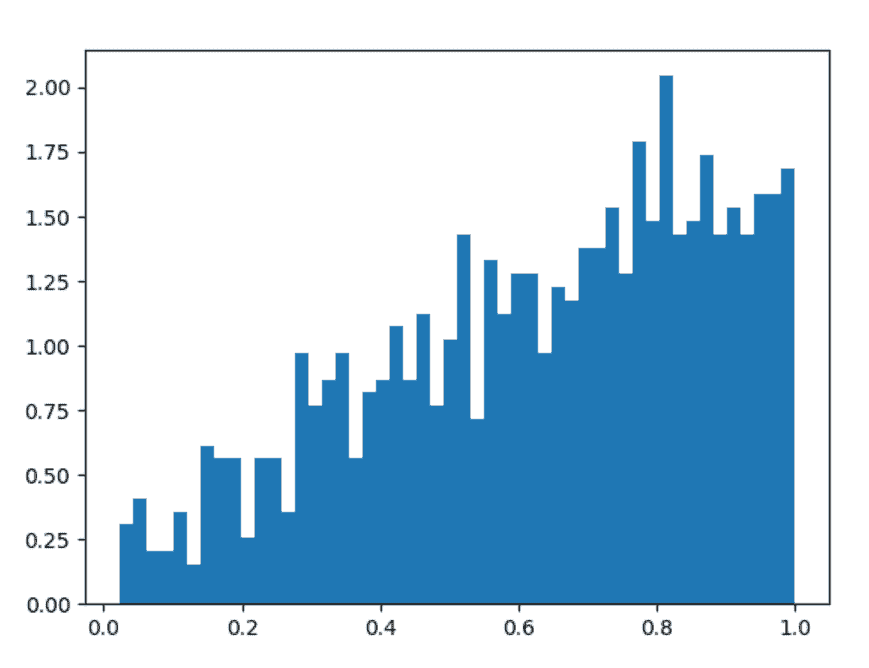
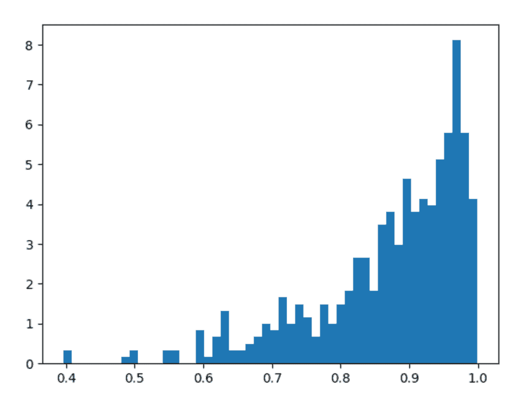

# Python 中的 numpy.random.power()

> 原文:[https://www.geeksforgeeks.org/numpy-random-power-in-python/](https://www.geeksforgeeks.org/numpy-random-power-in-python/)

借助 **numpy.random.power()** 方法，我们可以从功率分布中获取随机样本，并利用该方法返回随机样本。



配电

> **语法:** numpy.random.power(a，size=None)
> 
> **返回:**将随机样本作为 numpy 数组返回。

**示例#1 :**

在这个例子中我们可以看到，通过使用 **numpy.random.power()** 方法，我们能够从功率分布中获得随机样本并返回随机样本。

## 蟒蛇 3

```py
# import numpy
import numpy as np
import matplotlib.pyplot as plt

# Using power() method
gfg = np.random.power(1.75, 1000)

plt.figure()
plt.hist(gfg, bins = 50, density = True)
plt.show()
```

**输出:**

> 
> 
> Power diagram

**例 2 :**

## 蟒蛇 3

```py
# import numpy
import numpy as np
import matplotlib.pyplot as plt

# Using power() method
gfg = np.random.power(6.75, 500)

plt.figure()
plt.hist(gfg, bins = 50, density = True)
plt.show()
```

**输出:**

> 
> 
> Power diagram