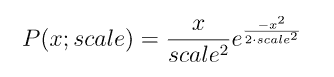
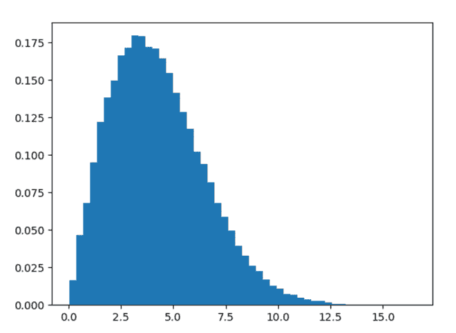
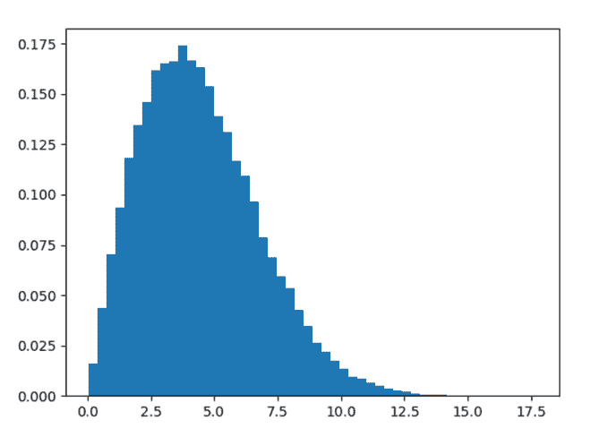

# python 中的 numpy.random.rayleigh()

> 原文:[https://www . geesforgeks . org/numpy-random-rayley-in-python/](https://www.geeksforgeeks.org/numpy-random-rayleigh-in-python/)

借助 **numpy.random.rayleigh()** 方法，我们可以从 rayleigh 分布中得到随机样本，并返回随机样本。



瑞利分布函数

> **语法:**numpy . random . Rayleigh(scale = 1.0，size=None)
> 
> **返回:**将随机样本作为 numpy 数组返回。

**示例#1 :**

在这个例子中我们可以看到，通过使用 **numpy.random.rayleigh()** 方法，我们能够得到 rayleigh 分布并返回随机样本。

## 蟒蛇 3

```py
# import numpy
import numpy as np
import matplotlib.pyplot as plt

# Using rayleigh() method
gfg = np.random.rayleigh(3.4, 50000)

plt.figure()
plt.hist(gfg, bins = 50, density = True)
plt.show()
```

**输出:**

> 

**例 2 :**

## 蟒蛇 3

```py
# import numpy
import numpy as np
import matplotlib.pyplot as plt

# Using rayleigh() method
gfg = np.random.rayleigh(2 * np.sqrt(np.pi), 100000)

plt.figure()
plt.hist(gfg, bins = 50, density = True)
plt.show()
```

**输出:**

> 