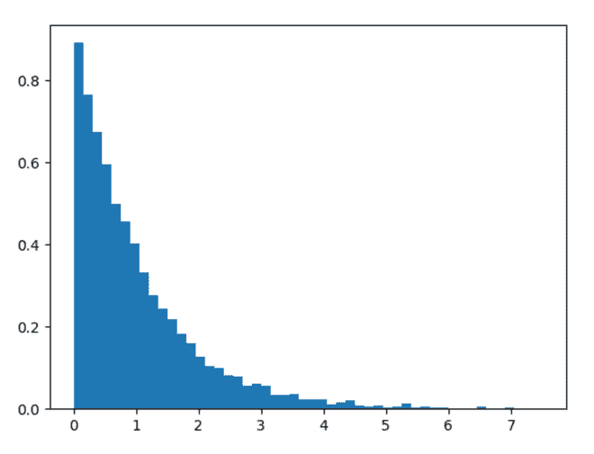
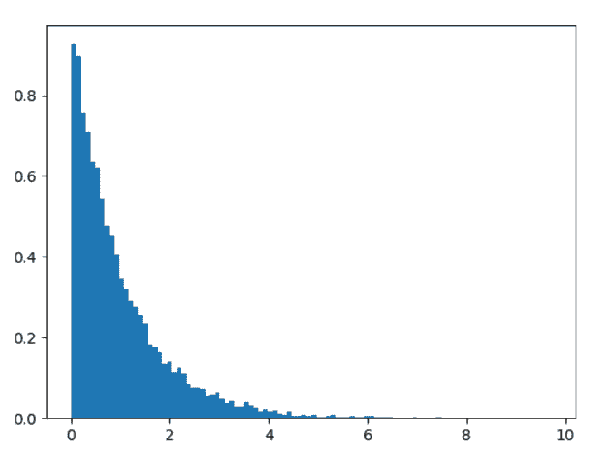

# Python 中的 numpy . random . standard _ index()

> 原文:[https://www . geesforgeks . org/numpy-random-standard _ index-in-python/](https://www.geeksforgeeks.org/numpy-random-standard_exponential-in-python/)

借助**numpy . random . standard _ index()**方法，可以得到标准指数分布的随机样本，并返回随机样本。

> **语法:**numpy . random . standard _ index(size = None)
> 
> **返回:**将随机样本作为 numpy 数组返回。

**示例#1 :**

在这个例子中我们可以看到，通过使用**numpy . random . standard _ index()**方法，我们能够从标准指数分布中获得随机样本并返回随机样本。

## 蟒蛇 3

```
# import numpy
import numpy as np
import matplotlib.pyplot as plt

# Using standard_exponential() method
gfg = np.random.standard_exponential(5000)

plt.hist(gfg, bins = 50, density = True)
plt.show()
```

**输出:**

> 

**例 2 :**

## 蟒蛇 3

```
# import numpy
import numpy as np
import matplotlib.pyplot as plt

# Using standard_exponential() method
gfg = np.random.standard_exponential(10000)

plt.hist(gfg, bins = 100, density = True)
plt.show()
```

**输出:**

> 