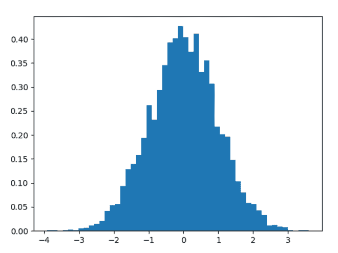
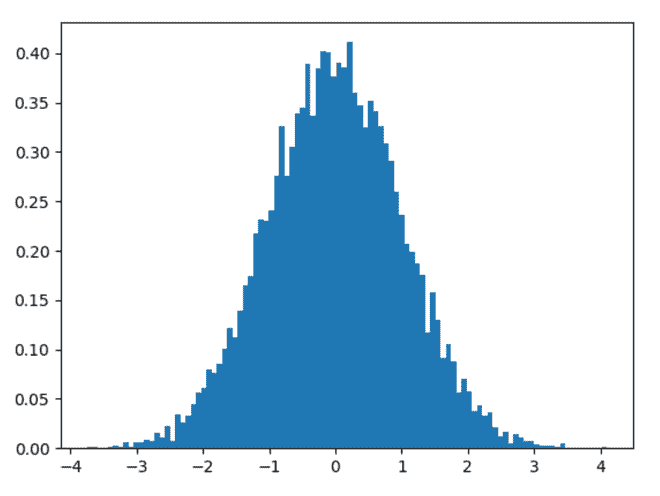

# Python 中的 numpy.random.standard_normal()

> 原文:[https://www . geesforgeks . org/numpy-random-standard _ normal-in-python/](https://www.geeksforgeeks.org/numpy-random-standard_normal-in-python/)

借助**numpy . random . standard _ normal()**方法，我们可以从标准正态分布中获取随机样本，并利用该方法将随机样本作为 numpy 数组返回。

> **语法:**numpy . random . standard _ normal(大小=无)
> 
> **返回:**将随机样本作为 numpy 数组返回。

**示例#1 :**

在这个例子中我们可以看到，通过使用 numpy.random.standard_normal()方法，我们能够得到标准正态分布的随机样本。

## 蟒蛇 3

```
# import numpy
import numpy as np
import matplotlib.pyplot as plt

# Using standard_normal() method
gfg = np.random.standard_normal(5000)

plt.hist(gfg, bins = 50, density = True)
plt.show()
```

**输出:**

> 

**例 2 :**

## 蟒蛇 3

```
# import numpy
import numpy as np
import matplotlib.pyplot as plt

# Using standard_normal() method
gfg = np.random.standard_normal(10000)

plt.hist(gfg, bins = 100, density = True)
plt.show()
```

**输出:**

> 