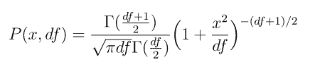
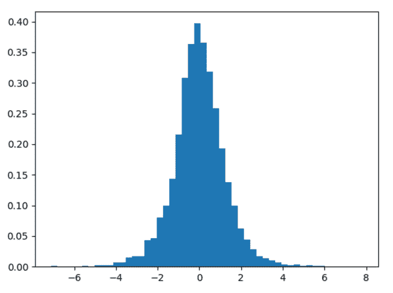
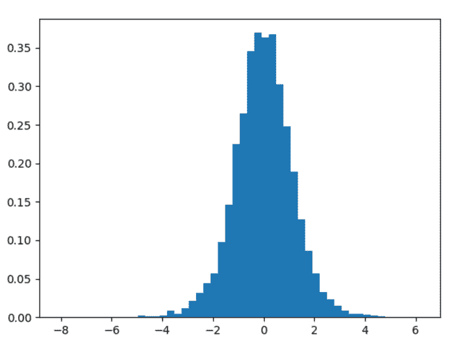

# Python 中的 numpy.random.standard_t()

> 原文:[https://www . geesforgeks . org/numpy-random-standard _ t-in-python/](https://www.geeksforgeeks.org/numpy-random-standard_t-in-python/)

借助**numpy . random . standard _ T()**方法，可以从具有自由度的标准 T 分布中获取随机样本，并利用该方法返回随机样本。



标准 t 分布

> **语法:** numpy.random.standard_t(df，size=None) #这里 df 是自由度。
> 
> **返回:**将随机样本作为 numpy 数组返回。

**示例#1 :**

在这个例子中，我们可以看到，通过使用**numpy . random . standard _ T()**方法，我们能够获得具有自由度的标准 T 分布的随机样本，并返回 numpy 数组。

## 蟒蛇 3

```
# import numpy
import numpy as np
import matplotlib.pyplot as plt

# Using standard_t() method
gfg = np.random.standard_t(5, 5000)

plt.hist(gfg, bins = 50, density = True)
plt.show()
```

**输出:**

> 

**例 2 :**

## 蟒蛇 3

```
# import numpy
import numpy as np
import matplotlib.pyplot as plt

# Using standard_t() method
gfg = np.random.standard_t(7, 10000)

plt.hist(gfg, bins = 50, density = True)
plt.show()
```

**输出:**

> 