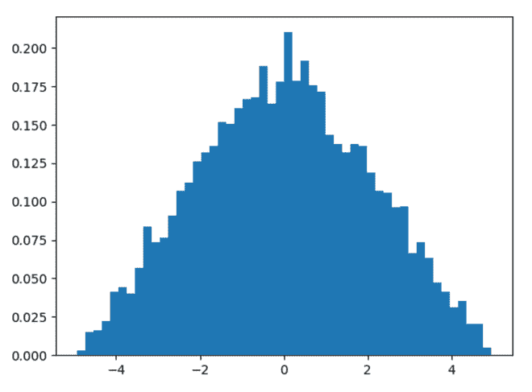
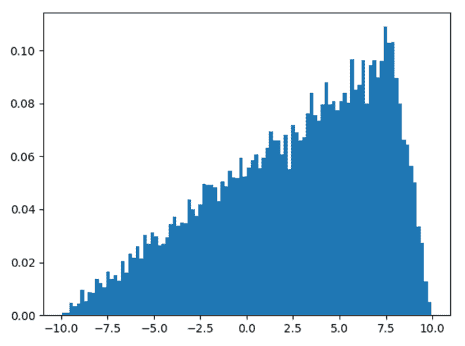

# Python 中的 numpy . random . trial()

> 原文:[https://www . geesforgeks . org/numpy-random-trial-in-python/](https://www.geeksforgeeks.org/numpy-random-triangular-in-python/)

借助**numpy . random . triangular()**方法，我们可以从区间**【左，右】**的三角分布中获取随机样本，并利用该方法返回随机样本。

> **语法:** numpy.random.triangular(左，模式，右，大小=无)
> 
> **参数:**
> 
> **1)左侧–**三角形的下限。
> 
> **2)模式–**分布的峰值。
> 
> **3)右侧–**三角形的上限。
> 
> **4)尺寸–**所需样品总数。
> 
> **返回:**将随机样本作为 numpy 数组返回。

**示例#1 :**

在这个例子中我们可以看到，通过使用**numpy . random . triangular()**方法，我们能够得到三角形分布的随机样本，并返回 numpy 数组。

## 蟒蛇 3

```py
# import numpy
import numpy as np
import matplotlib.pyplot as plt

# Using triangular() method
gfg = np.random.triangular(-5, 0, 5, 5000)

plt.hist(gfg, bins = 50, density = True)
plt.show()
```

**输出:**

> 

**例 2 :**

## 蟒蛇 3

```py
# import numpy
import numpy as np
import matplotlib.pyplot as plt

# Using triangular() method
gfg = np.random.triangular(-10, 8, 10, 15000)

plt.hist(gfg, bins = 100, density = True)
plt.show()
```

**输出:**

> 