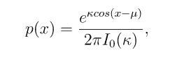
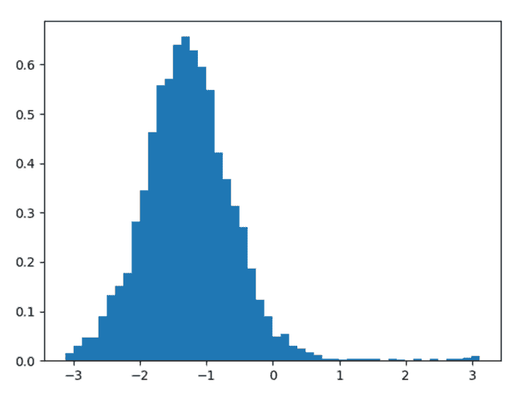
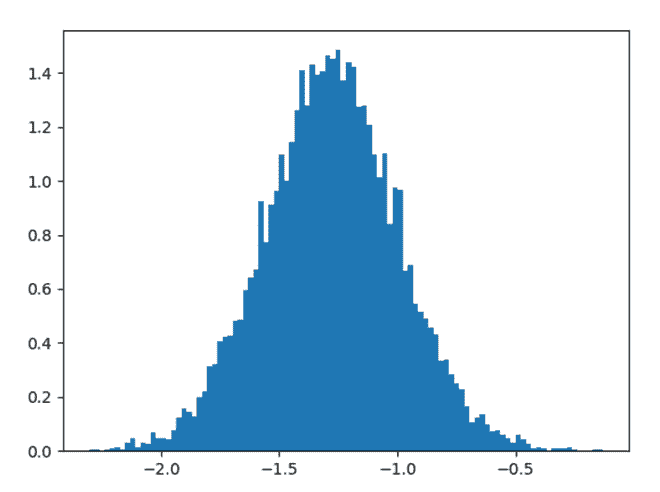

# python 中的 num py . random . ms ises()

> 哎哎哎:# t0]https://www . geeksforgeeks . org/num py-random-many times-in-python/

借助于 **numpy.random.vonmises()** 方法，我们可以从 vonmises 分布中获得随机样本，并使用该方法将随机样本作为 numpy 数组返回。



Mises 等效应力

> **语法:** numpy.random.vonmises(mu，kappa，size=None)
> 
> **返回:**将随机样本作为 numpy 数组返回。

**示例#1 :**

在这个例子中我们可以看到，通过使用 **numpy.random.vonmises()** 方法，我们能够从 vonmises 分布中获得随机样本并返回 numpy 数组。

## 蟒蛇 3

```py
# import numpy
import numpy as np
import matplotlib.pyplot as plt

# Using vonmises() method
gfg = np.random.vonmises(5, 3, 5000)

plt.hist(gfg, bins = 50, density = True)
plt.show()
```

**输出:**

> 

**例 2 :**

## 蟒蛇 3

```py
# import numpy
import numpy as np
import matplotlib.pyplot as plt

# Using vonmises() method
gfg = np.random.vonmises(5, 13, 10000)

plt.hist(gfg, bins = 100, density = True)
plt.show()
```

**输出:**

> 