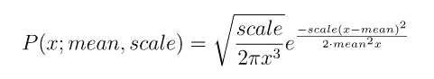
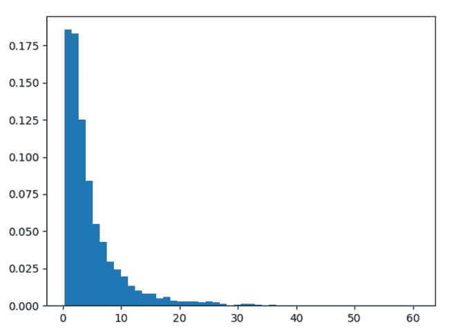
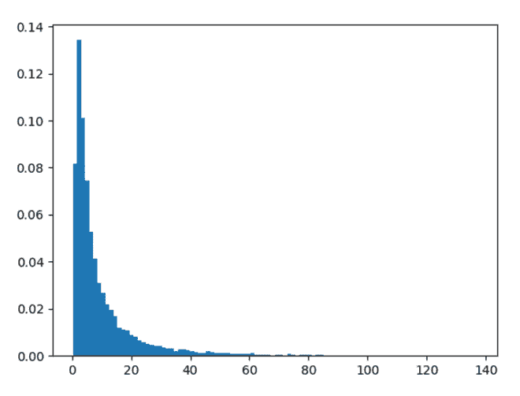

# Python 中的 numpy.random.wald()

> 原文:[https://www.geeksforgeeks.org/numpy-random-wald-in-python/](https://www.geeksforgeeks.org/numpy-random-wald-in-python/)

借助于 **numpy.random.wald()** 方法，我们可以从 wald 或逆高斯分布中获取随机样本，并利用该方法将随机样本作为 numpy 数组返回。



逆高斯分布

> **语法:** numpy.random.wald(平均值、比例、大小=无)
> 
> **返回:**将随机样本作为 numpy 数组返回。

**示例#1 :**

在这个例子中我们可以看到，通过使用 **numpy.random.wald()** 方法，我们能够从 wald 或逆高斯分布中获得随机样本并返回随机样本。

## 蟒蛇 3

```
# import numpy
import numpy as np
import matplotlib.pyplot as plt

# Using wald() method
gfg = np.random.wald(5, 3.7, 5000)

plt.hist(gfg, bins = 50, density = True)
plt.show()
```

**输出:**

> 

**例 2 :**

## 蟒蛇 3

```
# import numpy
import numpy as np
import matplotlib.pyplot as plt

# Using wald() method
gfg = np.random.wald(10, 5.5, 10000)

plt.hist(gfg, bins = 100, density = True)
plt.show()
```

**输出:**

> 