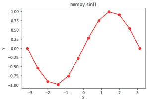

# Python 中的 numpy.sin()

> 哎哎哎:# t0]https://www . geeksforgeeks . org/num py-sin-python/

**numpy.sin(x[，out]) = ufunc 'sin') :** 这个数学函数帮助用户计算所有 x(作为数组元素)的三角正弦。
**参数:**

```
array    : [array_like]elements are in radians. 
```

```
2pi Radians = 36o degrees
```

**返回:**

```
An array with trigonometric sine of
x for all x i.e. array elements 
```

**代码#1:工作**

## 计算机编程语言

```
# Python program explaining
# sin() function

import numpy as np
import math

in_array = [0, math.pi / 2, np.pi / 3, np.pi]
print ("Input array : \n", in_array)

Sin_Values = np.sin(in_array)
print ("\nSine values : \n", Sin_Values)
```

**输出:**

```
Input array : 
 [0, 1.5707963267948966, 1.0471975511965976, 3.141592653589793]

Sine values : 
 [  0.00000000e+00   1.00000000e+00   8.66025404e-01   1.22464680e-16]
```

**代码#2:图形表示**

## 计算机编程语言

```
# Python program showing
# Graphical representation of
# sin() function

import numpy as np
import matplotlib.pyplot as plt

in_array = np.linspace(-np.pi, np.pi, 12)
out_array = np.sin(in_array)

print("in_array : ", in_array)
print("\nout_array : ", out_array)

# red for numpy.sin()
plt.plot(in_array, out_array, color = 'red', marker = "o")
plt.title("numpy.sin()")
plt.xlabel("X")
plt.ylabel("Y")
plt.show()
```

**输出:**

```
in_array :  [-3.14159265 -2.57039399 -1.99919533 -1.42799666 -0.856798   -0.28559933
  0.28559933  0.856798    1.42799666  1.99919533  2.57039399  3.14159265]

out_array :  [ -1.22464680e-16  -5.40640817e-01  -9.09631995e-01  -9.89821442e-01
  -7.55749574e-01  -2.81732557e-01   2.81732557e-01   7.55749574e-01
   9.89821442e-01   9.09631995e-01   5.40640817e-01   1.22464680e-16]
```



**参考文献:**
[https://docs . scipy . org/doc/numpy-dev/reference/generated/numpy . sin . html # numpy . sin](https://docs.scipy.org/doc/numpy-dev/reference/generated/numpy.sin.html#numpy.sin)
。