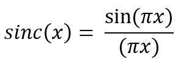

# numpy.sinc()在 Python

中

> 哎哎哎:# t0]https://www . geeksforgeeks . org/num py-sinon python/

**`numpy.sinc(array)` :** 这个数学函数帮助用户计算所有 x(作为数组元素)的 sinc 函数。



> **参数:**
> **数组:**【array _ like】元素以弧度为单位。2pi 弧度= 360 度
> 
> **返回:**
> 所有 x，即数组元素的 sinc 值为 x 的数组。

**代码#1:工作**

```py
# Python3 program explaining 
# sinc() function 
import numpy as np 
import math 

in_array = [0, math.pi / 2, np.pi / 3, np.pi] 
print ("Input array : \n", in_array) 

sinc_Values = np.sinc(in_array) 
print ("\nSinc values : \n", sinc_Values) 
```

**输出:**

```py
Input array : 
 [0, 1.5707963267948966, 1.0471975511965976, 3.141592653589793]

Sinc values : 
 [ 1\.         -0.19765087 -0.04490537 -0.04359863]

```

**代码#2:图形表示**

```py
# Python program showing Graphical 
# representation of sinc() function 
import numpy as np 
import matplotlib.pyplot as plt 

in_array = np.linspace(-np.pi, np.pi, 12) 
out_array = np.sinc(in_array) 

print("in_array : ", in_array) 
print("\nout_array : ", out_array) 

# red for numpy.sinc() 
plt.plot(in_array, out_array, color = 'red', marker = "o") 
plt.title("numpy.sinc()") 
plt.xlabel("X") 
plt.ylabel("Y") 

plt.show() 
```

**输出:**

```py
in_array :  [-3.14159265 -2.57039399 -1.99919533 -1.42799666 -0.856798   -0.28559933
  0.28559933  0.856798    1.42799666  1.99919533  2.57039399  3.14159265]

out_array :  [-4.35986286e-02  1.20821077e-01 -4.02499006e-04 -2.17227951e-01
  1.61555129e-01  8.71125992e-01  8.71125992e-01  1.61555129e-01
 -2.17227951e-01 -4.02499006e-04  1.20821077e-01 -4.35986286e-02]

```