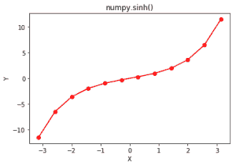

# Python 中的 numpy.sinh()

> 哎哎哎:# t0]https://www . geeksforgeeks . org/num py-sinh-python/

**numpy.sinh()** 是一个数学函数，帮助用户计算所有 x(作为数组元素)的双曲正弦。

相当于**1/2 *(NP . exp(x)–NP . exp(-x))或-1j * np.sin(1j*x)。**

> **语法:** numpy.sinh(x[，out]) = ufunc 'sin')
> **参数:**
> 
> **数组:***【array _ like】*元素以弧度为单位。
> 2pi 弧度= 360 度
> 
> **返回:**所有 x 的双曲正弦为 x 的数组，即数组元素

**代码#1:工作**

```
# Python3 program explaining
# sinh() function

import numpy as np
import math

in_array = [0, math.pi / 2, np.pi / 3, np.pi]
print ("Input array : \n", in_array)

Sinh_Values = np.sinh(in_array)
print ("\nSine Hyperbolic values : \n", Sinh_Values)
```

**输出:**

```
Input array : 
 [0, 1.5707963267948966, 1.0471975511965976, 3.141592653589793]

Sine Hyperbolic values : 
 [  0\.           2.3012989    1.24936705  11.54873936]

```

**代码#2:图形表示**

```
# Python program showing Graphical
# representation of sinh() function
import numpy as np
import matplotlib.pyplot as plt

in_array = np.linspace(-np.pi, np.pi, 12)
out_array = np.sinh(in_array)

print("in_array : ", in_array)
print("\nout_array : ", out_array)

# red for numpy.sinh()
plt.plot(in_array, out_array, color = 'red', marker = "o")
plt.title("numpy.sinh()")
plt.xlabel("X")
plt.ylabel("Y")
plt.show()
```

**输出:**

```
in_array :  [-3.14159265 -2.57039399 -1.99919533 -1.42799666 -0.856798   -0.28559933
  0.28559933  0.856798    1.42799666  1.99919533  2.57039399  3.14159265]

out_array :  [-11.54873936  -6.49723393  -3.62383424  -1.9652737   -0.96554336
  -0.28949778   0.28949778   0.96554336   1.9652737    3.62383424
   6.49723393  11.54873936]
```



**参考文献:**
[https://docs . scipy . org/doc/numpy-1 . 14 . 0/reference/generated/numpy . sinh . html # numpy . sinh](https://docs.scipy.org/doc/numpy-1.14.0/reference/generated/numpy.sinh.html#numpy.sinh)
。