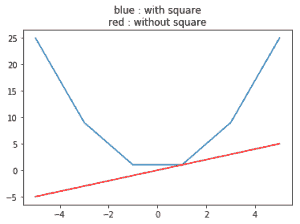

# Python 中的 numpy.square()

> 哎哎哎:# t0]https://www . geeksforgeeks . org/num py-square-python/

**numpy.square(arr，out = None，ufunc 'square') :** 这个数学函数帮助用户计算数组中每个元素的平方值。

**参数:**

```
arr  : *[array_like]* Input array or object
          whose elements, we need to square.

```

**返回:**

```
An array with square value of each array.  

```

**代码#1:工作**

```
# Python program explaining
# square () function

import numpy as np

arr1 = [1, -3, 15, -466]
print ("Square Value of arr1 : \n", np.square(arr1))

arr2 = [23 ,-56]
print ("\nSquare Value of arr2 : ", np.square(arr2))
```

**输出:**

```
Square Value of arr1 : 
 [     1      9    225 217156]

Square Value of arr2 :  [ 529 3136]

```

**代码#2:处理复数**

```
# Python program explaining
# square () function

import numpy as np

a = 4 + 3j
print("Square(4 + 3j) : ", np.square(a))

b = 16 + 13j
print("\nSquare value(16 + 13j) : ", np.square(b))
```

**输出:**

```
Square(4 + 3j) :  (7+24j)

Square value(16 + 13j) :  (87+416j)
```

**代码# 3:numpy . square()的图形表示**

```
# Python program explaining
# square () function

import numpy as np
import matplotlib.pyplot as plt

a = np.linspace(start = -5, stop = 5,
                num = 6, endpoint = True)

print("Graphical Representation : \n", np.square(a))

plt.title("blue : with square\nred : without square")
plt.plot(a, np.square(a))

plt.plot(a, a, color = 'red')
plt.show()
```

**输出:**

```
Graphical Representation : 
 [ 25\.   9\.   1\.   1\.   9\.  25.]

```


**参考文献:**
[https://docs . scipy . org/doc/numpy-1 . 13 . 0/reference/generated/numpy . absolute . html](https://docs.scipy.org/doc/numpy-1.13.0/reference/generated/numpy.absolute.html)
。