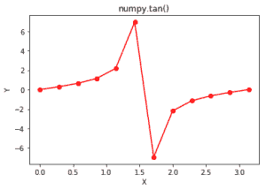

# Python 中的 numpy.tan()

> 哎哎哎:# t0]https://www . geeksforgeeks . org/num py-tan-python/

**numpy.tan(array[，out])= ufunc ' tan ':**这个数学函数帮助用户计算所有 x(作为数组元素)的三角正切。
T3】参数:

```py
array    : [array_like]elements are in radians.
out      : [optional]shape same as array.  
```

```py
2pi Radians = 360 degrees
tan(x) = sin(x) / cos(x)
```

**返回:**

```py
An array with trigonometric sine
of x for all x i.e. array elements 
```

**代码#1:工作**

## 计算机编程语言

```py
# Python program explaining
# tan() function

import numpy as np
import math

in_array = [0, math.pi / 4, 3*np.pi / 2, math.pi/6]
print ("Input array : \n", in_array)

tan_Values = np.tan(in_array)
print ("\nTan values : \n", tan_Values)
```

**输出:**

```py
Input array : 
 [0, 0.7853981633974483, 4.71238898038469, 0.5235987755982988]

Tan values : 
 [  0.00000000e+00   1.00000000e+00   5.44374645e+15   5.77350269e-01]
```

**代码#2:图形表示**

## 计算机编程语言

```py
# Python program showing
# Graphical representation of
# tan() function

import numpy as np
import matplotlib.pyplot as plt

in_array = np.linspace(0, np.pi, 12)
out_array = np.tan(in_array)

print("in_array : ", in_array)
print("\nout_array : ", out_array)

# red for numpy.tan()
plt.plot(in_array, out_array, color = 'red', marker = "o")
plt.title("numpy.tan()")
plt.xlabel("X")
plt.ylabel("Y")
plt.show()
```

**输出:**

```py
in_array :  [ 0\.          0.28559933  0.57119866  0.856798    1.14239733  1.42799666
  1.71359599  1.99919533  2.28479466  2.57039399  2.85599332  3.14159265]

out_array :  [  0.00000000e+00   2.93626493e-01   6.42660977e-01   1.15406152e+00
   2.18969456e+00   6.95515277e+00  -6.95515277e+00  -2.18969456e+00
  -1.15406152e+00  -6.42660977e-01  -2.93626493e-01  -1.22464680e-16]
```



**参考文献:**
[https://docs . scipy . org/doc/numpy-dev/reference/generated/numpy . tan . html # numpy . tan](https://docs.scipy.org/doc/numpy-dev/reference/generated/numpy.tan.html#numpy.tan)
。