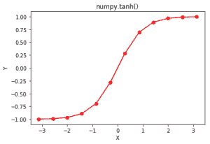

# Python 中的 numpy.tanh()

> 哎哎哎:# t0]https://www . geeksforgeeks . org/num py-tanh-python/

**numpy.tanh()** 是一个数学函数，帮助用户计算所有 x(作为数组元素)的双曲正切。

相当于 **`np.sinh(x) / np.cosh(x) or -1j * np.tan(1j*x)`。**

> **语法:** numpy.tanh(x[，out]) = ufunc 'tanh')
> **参数:**
> 
> **数组:***【array _ like】*元素以弧度为单位。
> 2pi 弧度= 360 度
> 
> **返回:**所有 x 的双曲正切为 x 的数组，即数组元素

**代码#1:工作**

```py
# Python3 program explaining
# tanh() function

import numpy as np
import math

in_array = [0, math.pi / 2, np.pi / 3, np.pi]
print ("Input array : \n", in_array)

tanh_Values = np.tanh(in_array)
print ("\nTangent Hyperbolic values : \n", tanh_Values)
```

**输出:**

```py
Input array : 
 [0, 1.5707963267948966, 1.0471975511965976, 3.141592653589793]

Tangent Hyperbolic values : 
 [ 0\.          0.91715234  0.78071444  0.99627208]

```

**代码#2:图形表示**

```py
# Python program showing Graphical
# representation of tanh() function
import numpy as np
import matplotlib.pyplot as plt

in_array = np.linspace(-np.pi, np.pi, 12)
out_array = np.tanh(in_array)

print("in_array : ", in_array)
print("\nout_array : ", out_array)

# red for numpy.tanh()
plt.plot(in_array, out_array, color = 'red', marker = "o")
plt.title("numpy.tanh()")
plt.xlabel("X")
plt.ylabel("Y")
plt.show()
```

**输出:**

```py
in_array :  [-3.14159265 -2.57039399 -1.99919533 -1.42799666 -0.856798   -0.28559933
  0.28559933  0.856798    1.42799666  1.99919533  2.57039399  3.14159265]

out_array :  [-0.99627208 -0.98836197 -0.96397069 -0.89125532 -0.69460424 -0.27807943
  0.27807943  0.69460424  0.89125532  0.96397069  0.98836197  0.99627208]
```



**参考文献:**[https://docs . scipy . org/doc/numpy-dev/reference/generated/numpy . tanh . html # numpy . tanh](https://docs.scipy.org/doc/numpy-dev/reference/generated/numpy.tanh.html#numpy.tanh)
。