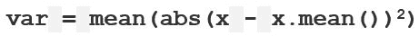

# python 中的 numpy.var()

> 原文:[https://www.geeksforgeeks.org/numpy-var-in-python/](https://www.geeksforgeeks.org/numpy-var-in-python/)

**`numpy.var(arr, axis = None)` :** 计算给定数据(数组元素)沿指定轴(如果有)的方差。


**示例:**

> x = 1 1 1 1
> 标准差= 0。方差= 0
> 
> y = 9，2，5，4，12，7，8，11，9，3，7，4，12，5，4，10，9，6，9，4
> 
> **第一步:**分布均值 4 = 7
> **第二步:**求和(x–x .均值())**2 = 178
> **第三步:**求均值= 178 /20 = 8.9
> 这个结果就是**方差**。

**参数:**

> **arr:**【array _ like】输入数组。
> **轴:**【int 或 int 的元组】轴，我们要沿着该轴计算方差。否则会认为`arr` 被展平(在所有轴上工作)。axis = 0 表示沿列的方差，axis = 1 表示沿行的方差。
> **出:**【n 数组，可选】我们想要放置结果的不同数组。数组必须具有与预期输出相同的维度。
> **数据类型:**【数据类型，可选】计算方差时我们想要的类型。
> 
> **结果:**数组(如果轴为无，则为标量值)或沿指定轴具有方差值的数组的方差。

**代码#1:**

```py
# Python Program illustrating 
# numpy.var() method 
import numpy as np 

# 1D array 
arr = [20, 2, 7, 1, 34] 

print("arr : ", arr) 
print("var of arr : ", np.var(arr)) 

print("\nvar of arr : ", np.var(arr, dtype = np.float32)) 
print("\nvar of arr : ", np.var(arr, dtype = np.float64)) 
```

**输出:**

```py
arr :  [20, 2, 7, 1, 34]
var of arr :  158.16

var of arr :  158.16

var of arr :  158.16
```

**代码#2:**

```py
# Python Program illustrating 
# numpy.var() method 
import numpy as np 

# 2D array 
arr = [[2, 2, 2, 2, 2], 
    [15, 6, 27, 8, 2], 
    [23, 2, 54, 1, 2, ], 
    [11, 44, 34, 7, 2]] 

# var of the flattened array 
print("\nvar of arr, axis = None : ", np.var(arr)) 

# var along the axis = 0 
print("\nvar of arr, axis = 0 : ", np.var(arr, axis = 0)) 

# var along the axis = 1 
print("\nvar of arr, axis = 1 : ", np.var(arr, axis = 1)) 
```

**输出:**

```py
var of arr, axis = None :  236.14000000000004

var of arr, axis = 0 :  [ 57.1875 312.75   345.6875   9.25     0\.    ]

var of arr, axis = 1 :  [  0\.    77.04 421.84 269.04]
```