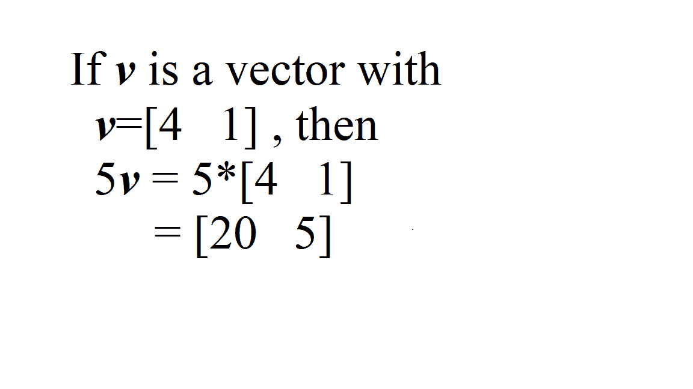
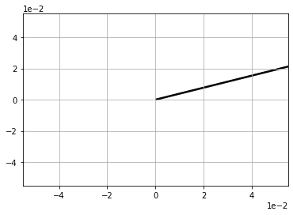
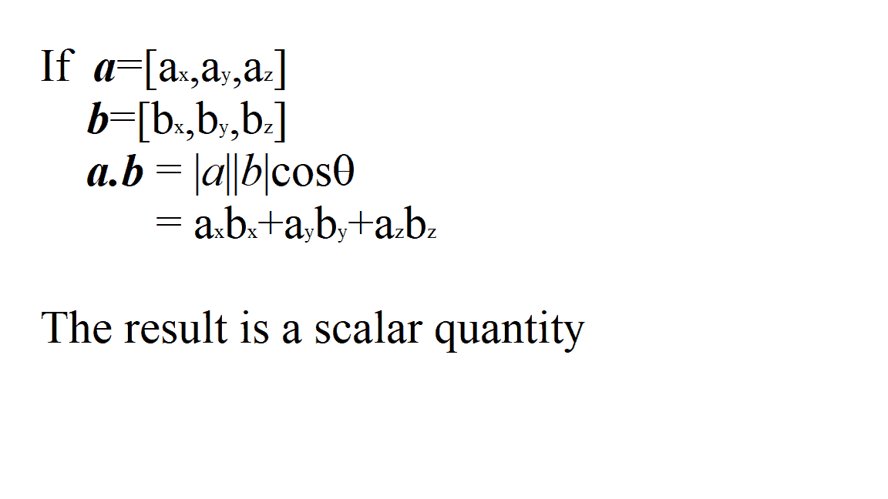
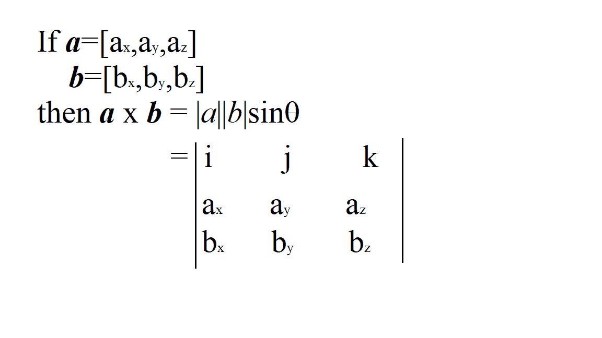

# NumPy |向量乘法

> 原文:[https://www.geeksforgeeks.org/numpy-vector-multiplication/](https://www.geeksforgeeks.org/numpy-vector-multiplication/)

向量乘法有三种类型:

*   数积
*   点积
*   Cross Product

    **标量乘法:**
    标量乘法可以用一个标量乘以向量矩阵中的所有元素来表示。
    [](https://media.geeksforgeeks.org/wp-content/uploads/20200325154750/scalar.png)

    **代码:解释标量乘法的 Python 代码**

    ```

    # importing libraries  
    import numpy as np
    import matplotlib.pyplot as plt
    import math

    v = np.array([4, 1])
    w = 5 * v
    print("w = ", w)

    # Plot w
    origin =[0], [0]
    plt.grid()
    plt.ticklabel_format(style ='sci', axis ='both', 
                         scilimits =(0, 0))
    plt.quiver(*origin, *w, scale = 10)
    plt.show()
    ```

    **输出:**

    ```
    w =  [20  5]
    ```

    

    **点积乘法:**
    [](https://media.geeksforgeeks.org/wp-content/uploads/20200325154743/dot3.png)

    **代码:解释点积乘法的 Python 代码**

    ```
    import numpy as np
    import math

    v = np.array([2, 1])
    s = np.array([3, -2])
    d = np.dot(v, s)
    print(d)
    ```

    这里，点积也可以用‘@’运算符来接收。

    > d = v@s

    **输出:**

    ```
    4
    ```

    **叉积:**
    [](https://media.geeksforgeeks.org/wp-content/uploads/20200325154801/cross1.png)

    **代码:解释叉积的 Python 代码**

    ```
    import numpy as np
    import math

    v = np.array([4, 9, 12])
    s = np.array([21, 32, 44])
    r = np.cross(v, s)
    print(r)
    ```

    **输出:**

    ```
    [ 12  76 -61]
    ```