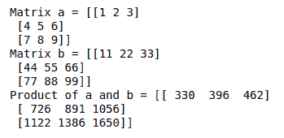

# NumPy 中的并行矩阵向量乘法

> 原文:[https://www . geesforgeks . org/parallel-matrix-vector-乘法 in-numpy/](https://www.geeksforgeeks.org/parallel-matrix-vector-multiplication-in-numpy/)

在这篇文章中，我们将讨论如何在 NumPy 中进行矩阵向量乘法。

## **矩阵与向量相乘**

对于矩阵向量乘法，有一些要点:

*   矩阵向量乘法的最终产物是向量。
*   这个向量的每个元素都是通过在矩阵的每行和被相乘的向量之间执行点积而获得的。
*   矩阵中的列数等于向量中的元素数。


```
# a and b are matrices
prod = numpy.matmul(a,b)
```

对于矩阵-向量乘法，我们将使用 NumPy***w*****e 的 ***np.matmul()*** 函数来定义一个 4×4 的矩阵和一个长度为 4 的向量。**

## **蟒蛇 3**

```
import numpy as np

a = np.array([[1, 2, 3, 13],
              [4, 5, 6, 14],
              [7, 8, 9, 15],
              [10, 11, 12, 16]])

b = np.array([10, 20, 30, 40])

print("Matrix a =", a)
print("Matrix b =", b)
print("Product of a and b =",
      np.matmul(a, b))
```

****输出:****

****

## ****与另一个矩阵的矩阵乘法****

**我们用点积做矩阵-矩阵乘法。我们也将为此使用相同的函数。**

```
prod = numpy.matmul(a,b)  # a and b are matrices
```

**对于矩阵-矩阵乘法，有一些要点:**

*   **第一个矩阵中的列数应该等于第二个矩阵中的行数。**
*   **如果我们将一个 m×n 维的矩阵与另一个 n×p 维的矩阵相乘，那么所得的乘积就是 m×p 维的矩阵**

**我们将定义两个 3×3 矩阵:**

## **蟒蛇 3**

```
import numpy as np

a = np.array([[1, 2, 3],
              [4, 5, 6],
              [7, 8, 9]])

b = np.array([[11, 22, 33],
              [44, 55, 66],
              [77, 88, 99]])

print("Matrix a =", a)
print("Matrix b =", b)
print("Product of a and b =", np.matmul(a, b))
```

****输出:****

****