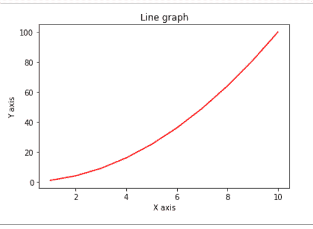
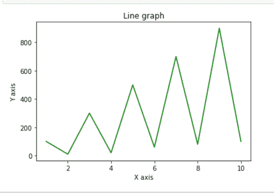

# 从 NumPy 阵列绘制线图

> 原文:[https://www . geeksforgeeks . org/plot-line-graph-from-numpy-array/](https://www.geeksforgeeks.org/plot-line-graph-from-numpy-array/)

为了在 Python 中绘制图形，我们将使用 Matplotlib 库。Matplotlib 与 NumPy 数据一起用于绘制任何类型的图形。从 matplotlib 中，我们使用特定的函数，即 **pyplot()** ，用于绘制二维数据。

使用的不同功能解释如下:

*   **np.arange(开始，结束):**此函数从间隔[开始，结束]返回等间距的值。
*   **plt.title():** 用于给图形一个标题。Title 作为参数传递给这个函数。
*   **plt.xlabel():** 在 X 轴设置标签名称。X 轴的名称作为参数传递给这个函数。
*   **plt.ylabel():** 在 Y 轴设置标签名称。Y 轴的名称作为参数传递给这个函数。
*   **plt.plot():** 它一起绘制传递给它的参数值。
*   **plt.show():** 它向控制台显示所有图形。

**例 1 :**

## 蟒蛇 3

```
# importing the modules
import numpy as np
import matplotlib.pyplot as plt

# data to be plotted
x = np.arange(1, 11)
y = x * x

# plotting
plt.title("Line graph")
plt.xlabel("X axis")
plt.ylabel("Y axis")
plt.plot(x, y, color ="red")
plt.show()
```

**输出:**



**例 2 :**

## 蟒蛇 3

```
# importing the library
import numpy as np
import matplotlib.pyplot as plt

# data to be plotted
x = np.arange(1, 11)
y = np.array([100, 10, 300, 20, 500, 60, 700, 80, 900, 100])

# plotting
plt.title("Line graph")
plt.xlabel("X axis")
plt.ylabel("Y axis")
plt.plot(x, y, color ="green")
plt.show()
```

**输出:**

