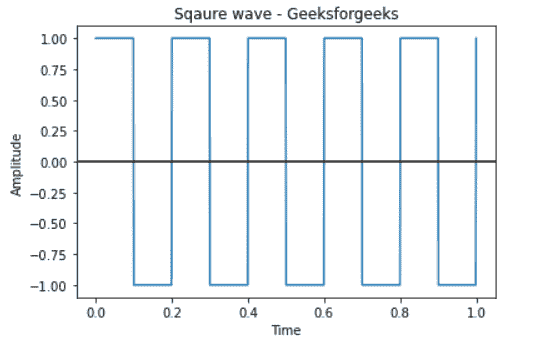

# 使用 Matplotlib、Numpy 和 Scipy 绘制方波

> 原文:[https://www . geesforgeks . org/ploging-a-square-wave-use-matplotlib-numpy-and-scipy/](https://www.geeksforgeeks.org/plotting-a-square-wave-using-matplotlib-numpy-and-scipy/)

**前提条件:**[【line space】](https://www.geeksforgeeks.org/numpy-linspace-python/)、[【mathplot lib】](https://www.geeksforgeeks.org/python-introduction-matplotlib/)、[【scipy】](https://www.geeksforgeeks.org/data-analysis-with-scipy/)

方波是一种非正弦周期波形，其振幅在固定的最小值和最大值之间以稳定的频率变化，在最小值和最大值时持续时间相同。图形表示总是容易理解，并且在任何书面或口头交流之前被采用和优选。在本文中，我们将尝试理解，如何使用 Scipy python 模块绘制方波。

**进场:**

*   导入所需模块。
*   创建采样率。
*   画一个方波。
*   给图表贴上标签。
*   显示图形。

**步骤 1:** 导入模块

## 蟒蛇 3

```py
from scipy import signal
import matplotlib.pyplot as plot
import numpy as np
```

**步骤 2:**NumPy linspace 函数是 Python 中的一个工具，用于创建在指定间隔内返回均匀间隔数字的数字序列。

## 蟒蛇 3

```py
t = np.linspace(0, 1, 1000, endpoint = True)
```

**第三步:**绘图。绘图功能:该方法接受以下参数并绘制方波信号。

> **语法:**
> 
> scipy.signal.square(t)
> 
> **参数:**
> 
> *   **t:** 输入时间数组。
> 
> **返回:**
> 
> 包含方波波形的输出数组。

## 蟒蛇 3

```py
# Plot the square wave
plot.plot(t, signal.square(2 * np.pi * 5 * t))
```

**第四步:**给出标题名、x 轴标签名、y 轴标签名。

## 蟒蛇 3

```py
# Give x,y, title axis label
plot.xlabel('Time')
plot.ylabel('Amplitude')
plot.title('Square wave - Geeksforgeeks')
```

**第五步:** plot.axhline():利用 matplotlib 库 pyplot 模块中的 axhline()函数，添加一条横过坐标轴的水平线。

## 蟒蛇 3

```py
# Provide x axis and black line color
plot.axhline(y=0, color='k')
```

**以下是完整实现:**

## 蟒蛇 3

```py
from scipy import signal
import matplotlib.pyplot as plot
import numpy as np

t = np.linspace(0, 1, 1000, endpoint=True)

# Plot the square wave
plot.plot(t, signal.square(2 * np.pi * 5 * t))

# Give x,y,title axis label
plot.xlabel('Time')
plot.ylabel('Amplitude')
plot.title('Square wave - Geeksforgeeks')

plot.axhline(y = 0, color = 'k')

# Display
plot.show()
```

**输出:**

