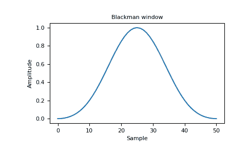
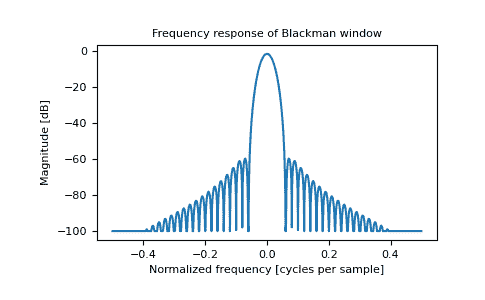

# python | num py 中的 black man

> 原文:[https://www.geeksforgeeks.org/python-blackman-in-numpy/](https://www.geeksforgeeks.org/python-blackman-in-numpy/)

**Blackman window :** 是利用余弦求和的前三项形成的锥度。它被设计成具有尽可能小的泄漏。它接近最优，只比凯泽窗稍差。

```py
Parameters(numpy.blackman): 
M : int Number of points in the output window.
    If zero or less, an empty array is returned.

Returns: 
out : array
```

窗口，最大值归一化为 1(只有当样本数为奇数时，才会出现值 1)。

**示例:**

```py
import numpy as np 
print(np.blackman(12))
```

**输出:**

```py
[ -1.38777878e-17   3.26064346e-02   1.59903635e-01   4.14397981e-01
   7.36045180e-01   9.67046769e-01   9.67046769e-01   7.36045180e-01
   4.14397981e-01   1.59903635e-01   3.26064346e-02  -1.38777878e-17]

```

**绘制窗口及其频率响应(需要 SciPy 和 matplotlib):**

**代码:窗口:**

```py
import numpy as np 
import matplotlib.pyplot as plt 
from numpy.fft import fft, fftshift 

window = np.blackman(51)

plt.plot(window) 
plt.title("Blackman window")
plt.ylabel("Amplitude") 
plt.xlabel("Sample") 
plt.show() 
```

**输出:**


**代码:频率:**

```py
import numpy as np 
import matplotlib.pyplot as plt 
from numpy.fft import fft, fftshift 

window = np.blackman(51)

plt.figure()

A = fft(window, 2048) / 25.5
mag = np.abs(fftshift(A))
freq = np.linspace(-0.5, 0.5, len(A))
response = 20 * np.log10(mag)
response = np.clip(response, -100, 100)

plt.plot(freq, response)
plt.title("Frequency response of Blackman window")
plt.ylabel("Magnitude [dB]")
plt.xlabel("Normalized frequency [cycles per sample]")
plt.axis('tight')
plt.show()
```

**输出:**
