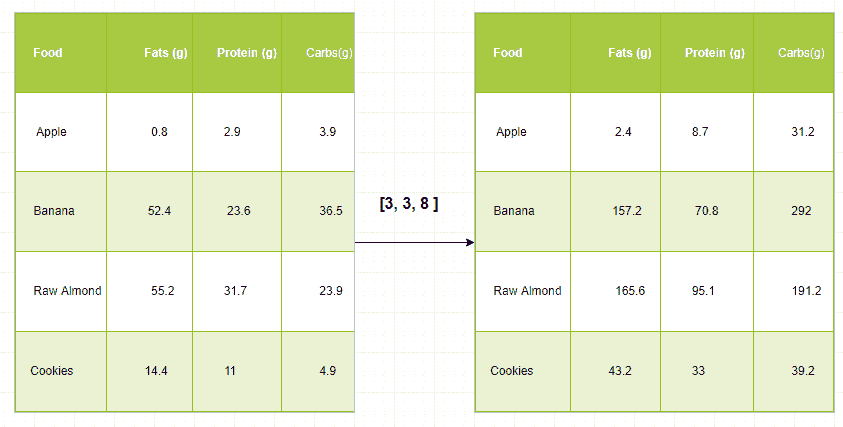
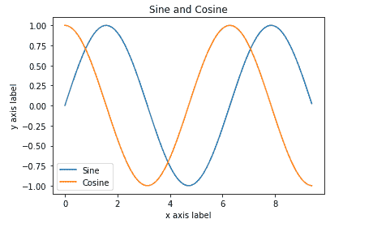

# Python |用 NumPy 数组广播

> 原文:[https://www . geeksforgeeks . org/python-broadcasting-with-numpy-arrays/](https://www.geeksforgeeks.org/python-broadcasting-with-numpy-arrays/)

术语 ***广播*** 指的是 numpy 如何在算术运算期间处理不同维度的数组，这导致某些约束，较小的数组在较大的数组中广播，以便它们具有兼容的形状。
广播提供了一种向量化数组操作的方法，这样循环就可以在 C 语言中进行，而不是像我们所知道的在 C 语言中实现的 Python。它可以做到这一点，而不会产生不必要的数据副本，从而实现高效的算法实现。有些情况下，广播是一个坏主意，因为它会导致内存使用效率低下，从而降低计算速度。
**示例–**

## 蟒蛇 3

```py
import numpy as np

A = np.array([5, 7, 3, 1])
B = np.array([90, 50, 0, 30])

# array are compatible because of same Dimension
c = a * b
print (c)
```

**更深层次理解的例子–**
假设我们有一个大数据集，每个数据都是一个参数列表。在 Numpy 中，我们有一个二维数组，其中每行是一个数据，行数是数据集的大小。假设我们想对所有这些数据进行某种缩放，每个参数都有自己的缩放因子，或者说每个参数都乘以某个因子。
为了有一些清晰的理解，让我们使用宏观营养分解来计算食物中的卡路里。粗略地说，食物的热量部分由脂肪(每克 9 卡路里)、蛋白质(4 cpg)和碳水化合物(4 cpg)组成。因此，如果我们列出一些食物(我们的数据)，并为每种食物列出其宏观营养素分解(参数)，那么我们可以将每种营养素乘以其热值(应用标度)来计算每种食物的热量分解。



通过这种转换，我们现在可以计算各种有用的信息。例如，一些食物中存在的总热量是多少，或者，给定我晚餐的明细，知道我从蛋白质中获得了多少热量，等等。
**让我们看看用 Numpy 产生这种计算的一种天真方式:**

## 蟒蛇 3

```py
macros = array([
  [0.8, 2.9, 3.9],
  [52.4, 23.6, 36.5],
  [55.2, 31.7, 23.9],
  [14.4, 11, 4.9]
   ])

# Create a new array filled with zeros,
# of the same shape as macros.
result = zeros_like(macros)

cal_per_macro = array([3, 3, 8])

# Now multiply each row of macros by
# cal_per_macro. In Numpy, `*` is
# element-wise multiplication between two arrays.
 for i in range(macros.shape[0]):
     result[i, :] = macros[i, :] * cal_per_macro

result
```

**输出:**

```py
array([[   2.4,    8.7,   31.2 ],
       [  157.2,   70.8,  292 ],
       [   165.6,  95.1,   191.2],
       [   43.2,   33,    39.2]])
```

### 算法:

**输入:**阵列 **A** 带 **m** 尺寸，阵列 **B** 带 **n** 尺寸

```py
p = max(m, n)
if m < p:
    left-pad A's shape with 1s until it also has p dimensions

else if n < p:
    left-pad B's shape with 1s until it also has p dimensions
result_dims = new list with p elements

for i in p-1 ... 0:
    A_dim_i = A.shape[i]
    B_dim_i = B.shape[i]
    if A_dim_i != 1 and B_dim_i != 1 and A_dim_i != B_dim_i:
        raise ValueError("could not broadcast")
    else:
        # Pick the Array which is having maximum Dimension
        result_dims[i] = max(A_dim_i, B_dim_i) 
```

**广播规则:**
两个阵列一起广播遵循以下规则:

1.  如果数组没有相同的等级，那么在较低等级数组的形状前面加上 1，直到两个形状具有相同的长度。
2.  如果两个数组在维度中的大小相同，或者其中一个数组在该维度中的大小为 1，则这两个数组在维度中是兼容的。
3.  如果阵列与所有维度兼容，它们可以一起广播。
4.  广播后，每个数组的行为就好像它的形状等于两个输入数组的元素形状的最大值。
5.  在任何维度中，如果一个数组的大小为 1，而另一个数组的大小大于 1，则第一个数组的行为就像是沿着该维度复制的。

**例#1:** 一维数组

## 蟒蛇 3

```py
import numpy as np
a = np.array([17, 11, 19]) # 1x3 Dimension array
print(a)
b = 3 
print(b)

# Broadcasting happened because of
# miss match in array Dimension.
c = a + b
print(c)
```

**输出:**

```py
[17 11 19]
3
[20 14 22]
```

**例 2:** 二维数组

## 蟒蛇 3

```py
import numpy as np
A = np.array([[11, 22, 33], [10, 20, 30]])
print(A)

b = 4
print(b)

C = A + b
print(C)
```

**输出:**

```py
[[11 22 33]
 [10 20 30]]
 4
[[15 26 37]
 [14 24 34]]
```

**例 3:**

## 蟒蛇 3

```py
import numpy as np

v = np.array([12, 24, 36]) 
w = np.array([45, 55])   

# To compute an outer product we first
# reshape v to a column vector of shape 3x1
# then broadcast it against w to yield an output
# of shape 3x2 which is the outer product of v and w
print(np.reshape(v, (3, 1)) * w)

X = np.array([[12, 22, 33], [45, 55, 66]])

# x has shape  2x3 and v has shape (3, )
# so they broadcast to 2x3,
print(X + v)

# Add a vector to each column of a matrix X has
# shape 2x3 and w has shape (2, ) If we transpose X
# then it has shape 3x2 and can be broadcast against w
# to yield a result of shape 3x2.

# Transposing this yields the final result
# of shape  2x3 which is the matrix.
print((x.T + w).T)

# Another solution is to reshape w to be a column
# vector of shape 2X1 we can then broadcast it
# directly against X to produce the same output.
print(x + np.reshape(w, (2, 1)))

# Multiply a matrix by a constant, X has shape  2x3.
# Numpy treats scalars as arrays of shape();
# these can be broadcast together to shape 2x3.
print(x * 2)
```

**输出:**

```py
[[ 4  5]
 [ 8 10]
 [12 15]]

[[2 4 6]
 [5 7 9]]

[[ 5  6  7]
 [ 9 10 11]]

[[ 5  6  7]
 [ 9 10 11]]

[[ 2  4  6]
 [ 8 10 12]]
```

**绘制二维函数–**
广播也经常用于显示基于二维函数的图像。如果我们想定义一个函数 z=f(x，y)。
**例:**

## 蟒蛇 3

```py
import numpy as np
import matplotlib.pyplot as plt

# Computes x and y coordinates for
# points on sine and cosine curves
x = np.arange(0, 3 * np.pi, 0.1)
y_sin = np.sin(x)
y_cos = np.cos(x)

# Plot the points using matplotlib
plt.plot(x, y_sin)
plt.plot(x, y_cos)
plt.xlabel('x axis label')
plt.ylabel('y axis label')
plt.title('Sine and Cosine')
plt.legend(['Sine', 'Cosine'])

plt.show()
```

**输出:**

