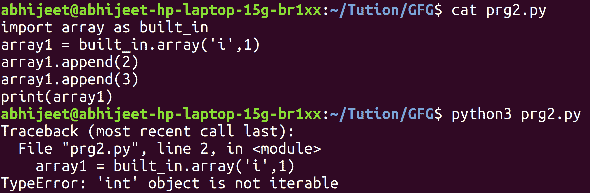
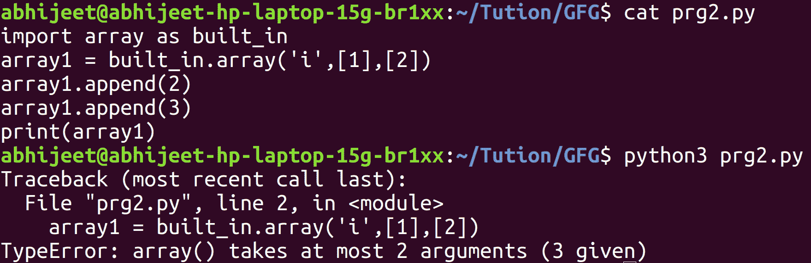
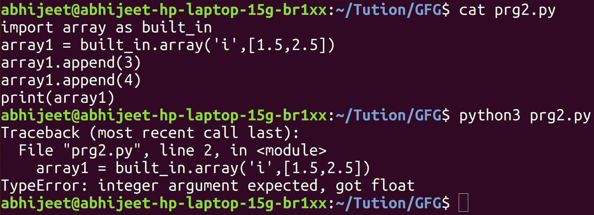
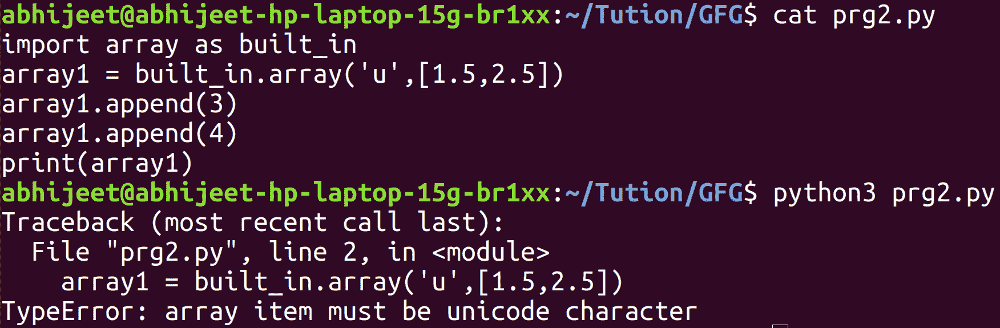
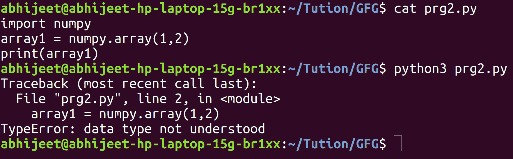

# Python–内置数组 vs NumPy 数组

> 原文:[https://www . geesforgeks . org/python-内置数组-vs-numpy-array/](https://www.geeksforgeeks.org/python-built-in-array-vs-numpy-array/)

让我们先专注于内置阵列模块。内置数组模块定义了一个对象类型，它可以有效地表示一个基本值数组:字符、整数、浮点数。数组是序列类型，除了存储在其中的对象类型受到约束之外，其行为非常类似于列表。

这意味着存储在数组中的对象属于同类(相同)类型。要存储在数组(内置)中的对象类型由 typecode 决定。类型代码是单个字符。

在数组模块**中，“数组(typecode [，初始值设定项])”**返回一个数组。其中**初始值设定项是可选的**，如果提供，它必须是列表、字符串或**可迭代的。**

**代码:**

```py
import array as built_in
array1 = built_in.array('i')
array1.append(1)
array1.append(2)
print(array1)
```

**输出:**

```py
array('i', [1, 2])

```

使用内置数组模块时，数组创建时是否**提供初始化器(初始化器可选)**是程序员的**调用。在前面代码的第 2 行，类型代码是*‘I’*，在那里我们没有提供任何初始化器，只是在数组的末尾一个接一个地添加了 1，2。**


这里我们确实提供了一个初始值设定项作为 int 值 1。出现错误，因为初始值设定项必须是可迭代的，并且整数是不可迭代的。


即使这次我们确实提供了可迭代的初始化器(列表)。但是数组最多接受 2 个参数。这里提供了 2 个初始值设定项，总共给了数组 3 个参数，导致了一个“类型错误”。

**代码:**

```py
import array as built_in
array1 = built_in.array('i', [1, 2])
array1.append(3)
array1.append(4)
print(array1)
```

**输出:**

```py
array('i', [1, 2, 3, 4])

```

提供可在元素上迭代的初始值设定项(最多 1 个)会导致代码的无错误执行。


这里给数组的类型代码表示，存储在数组中的对象必须是“int”类型。试图在数组中存储浮点值，导致类型错误。

这里给数组的类型码是表示数组中存储的对象必须是 Unicode 字符。试图在数组中存储浮点值，导致类型错误。**注意:**内置数组模块没有隐式类型转换数据(从 float 到 int)

python 中的 Numpy 模块一般用于矩阵和数组计算。使用 numpy 模块时，内置函数“array”用于创建数组。数组函数的原型是

> 数组(对象，数据类型=无，副本=真，顺序= 'K '，子对象=假，ndmin = 0)

除了对象，其他都是可选的。而对象是数组，任何暴露数组接口的对象，其 *__array__* 方法返回数组或任何(嵌套)序列的对象。而 dtype 是数组所需数据类型。
T3】代号:

```py
import numpy
array1 = numpy.array([1, 2, 3])
print(array1)
```

**输出:**

```py
[1 2 3]

```

在 numpy 模块的数组函数中，除了 object 之外的所有其他参数都是可选的。因此，即使我们没有传递其他参数，也没有错误。

**代码:**

```py
import numpy
array1 = numpy.array([1, 2, 3], int)
print(array1, type(array1[0]))
```

**输出:**

```py
[1 2 3] 

```

这里我们明确告诉 python，数组中存储的所有对象都应该被类型化为 *int* (如果可能的话)。

这里 python 将 1 作为参数“对象”的参数，将 2 作为参数“数据类型”的参数，因此 python 无法理解数据类型或解释数据类型。

**代码:**

```py
import numpy
array1 = numpy.array([1.5, 2.5], int)
print(array1, type(array1[0]), type(array1[1]))
```

**输出:**

```py
[1 2]  

```

这里浮点数据被类型化为 int，当数组的期望数据类型是 int 时，小数点后的数据丢失。
**代号:**

```py
import numpy
array1 = numpy.array([1.5, 2.5], str)
print(array1, type(array1[0]), type(array1[1]))
```

**输出:**

```py
['1.5' '2.5']  

```

这里浮点数据被类型化为字符串。请记住，在内置数组模块中，当数组的所需数据类型为 int 并且浮点值被传递给数组时。出现类型错误*“整数”参数应为浮点型“*”。当数组的期望数据类型是由 type code*‘u’*指定的 Unicode 字符，并且浮点值被发送到数组时，内置数组模块。出现类型错误“数组项必须是 Unicode 字符”。但是在 numpy 数组中，当需要的数组数据类型是 int 并且浮点值被发送到数组时。浮点值被类型化为 int(小数点后有数据丢失)，当数组的所需数据类型为 string 并且浮点值被发送到数组时，浮点值被类型化为 string。
这是内置阵列模块和 numpy 阵列的主要区别。内置数组对对象本身的存储要求非常严格。它只允许该类型的数据存储在自身中，这是由 typecode 严格指定的。当 typecode 指定 int 数据必须存储在内置数组中时，我们无法存储浮点值。然而，numpy 数组在这方面有点宽容或宽松，它将向上或向下转换，并试图不惜任何代价存储数据。(浮点被转换为整数，即使这导致小数点后的数据丢失)

**注意:**内置数组有 typecode 和 itemsize 等属性

> typecode —用于创建数组
> 项大小的 typecode 字符—一个数组项的长度(以字节为单位)

**代码:**

```py
import array as built_in
array1 = built_in.array('i', [1, 2])
print(array1)
print(array1.typecode)
print(array1.itemsize)
```

**输出:**

```py
array('i', [1, 2])
i
4

```

这里 typecode 'i '指定存储在数组中的对象将是有符号整数类型。

**异常:**–在 numpy 数组中，当数组的所需数据类型被显式赋予 int 或 float，然后字符串被发送到数组。值错误将会发生，因为无论如何都不可能将
字符串向上或向下转换为 float 或 int。