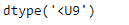
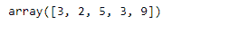
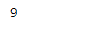
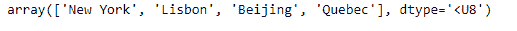
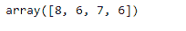
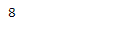

# Python | Numpy 字符串数组的 dtype 对象长度

> 原文:[https://www . geesforgeks . org/python-dtype-object-length-of-numpy-array-strings/](https://www.geeksforgeeks.org/python-dtype-object-length-of-numpy-array-of-strings/)

在这篇文章中，我们将看到当底层数据是字符串类型时 numpy 对象的数据类型。在 numpy 中，如果给定对象的基础数据类型是字符串，那么对象的数据类型就是数组中最长字符串的长度。这是因为我们不能在 numpy 中创建可变长度字符串，因为 numpy 需要知道应该为字符串分配多少空间。

**问题#1 :** 给定一个 numpy 数组，其基础数据是字符串类型。找到数据类型。

**解决方案:**我们将使用`numpy.dtype`属性来检查给定对象的数据类型。

```py
# importing the numpy library as np
import numpy as np

# Create a numpy array
arr = np.array(['Ela', 'Ed', 'Brook', 'Sia', 'Katherine'])

# Print the array
print(arr)
```

**输出:**


现在我们将检查给定数组对象的数据类型，该对象的基础数据是字符串类型。

```py
# Print the dtype
print(arr.dtype)
```

**输出:**

正如我们在输出中看到的，给定数组对象的数据类型是`'<U9'`，其中 9 是给定数组对象中最长字符串的长度。

让我们通过检查给定对象中最长字符串的长度来验证这一点。

```py
# Use vectorize function of numpy
length_checker = np.vectorize(len)

# Find the length of each element
arr_len = length_checker(arr)

# Print the length of each element
print(arr_len)

# Print the maximum value
print(arr_len.max())
```

**输出:**



**问题 2 :** 给定一个 numpy 数组，其底层数据为字符串类型。找到数据类型。

**解决方案:**我们将使用`numpy.dtype`属性来检查给定对象的数据类型。

```py
# importing the numpy library as np
import numpy as np

# Create a numpy array
arr = np.array(['New York', 'Lisbon', 'Beijing', 'Quebec'])

# Print the array
print(arr)
```

**输出:**


现在我们将检查给定数组对象的数据类型，该对象的基础数据是字符串类型。

```py
# Print the dtype
print(arr.dtype)
```

**输出:**

正如我们在输出中看到的，给定数组对象的数据类型是`'<U8'`，其中 8 是给定数组对象中最长字符串的长度。

让我们通过检查给定对象中最长字符串的长度来验证这一点。

```py
# Use vectorize function of numpy
length_checker = np.vectorize(len)

# Find the length of each element
arr_len = length_checker(arr)

# Print the length of each element
print(arr_len)

# Print the maximum value
print(arr_len.max())
```

**输出:**

