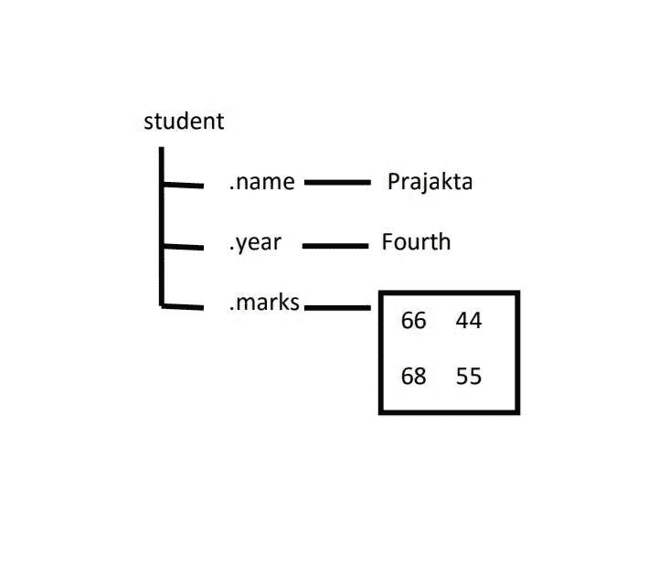

# Python: Numpy 的结构化数组

> 原文:[https://www . geesforgeks . org/python-numpys-structured-array/](https://www.geeksforgeeks.org/python-numpys-structured-array/)

Numpy 的结构化数组类似于 c 语言中的 Struct，用于对不同类型和大小的数据进行分组。结构数组使用称为字段的数据容器。每个数据字段可以包含任何类型和大小的数据。数组元素可以通过点符号来访问。
**注:**带命名字段的数组，可以包含各种类型和大小的数据。
**结构化阵列属性**

*   数组中的所有结构都有相同数量的字段。
*   所有结构都有相同的字段名。

例如，考虑一个结构化的学生数组，它有不同的字段，如姓名、年份、分数。



数组学生中的每个记录都有一个类结构。结构的数组称为 struct，为数组中的新结构添加任何新字段，包含空数组。
**例 1:**

## 蟒蛇 3

```
# Python program to demonstrate
# Structured array

import numpy as np

a = np.array([('Sana', 2, 21.0), ('Mansi', 7, 29.0)],
       dtype=[('name', (np.str_, 10)), ('age', np.int32), ('weight', np.float64)])

print(a)
```

**Output:** 

```
[('Sana', 2, 21.0) ('Mansi', 7, 29.0)]
```

**例 2:** 使用 numpy.sort()方法，将顺序作为参数传递，可以对结构数组进行排序。此参数采用需要对其进行排序的字段的值。

## 蟒蛇 3

```
# Python program to demonstrate
# Structured array

import numpy as np

a = np.array([('Sana', 2, 21.0), ('Mansi', 7, 29.0)],
       dtype=[('name', (np.str_, 10)), ('age', np.int32), ('weight', np.float64)])

# Sorting according to the name
b = np.sort(a, order='name')
print('Sorting according to the name', b)

# Sorting according to the age
b = np.sort(a, order='age')
print('\nSorting according to the age', b)
```

**Output:** 

```
Sorting according to the name [('Mansi', 7, 29.0) ('Sana', 2, 21.0)]

Sorting according to the age [('Sana', 2, 21.0) ('Mansi', 7, 29.0)]
```