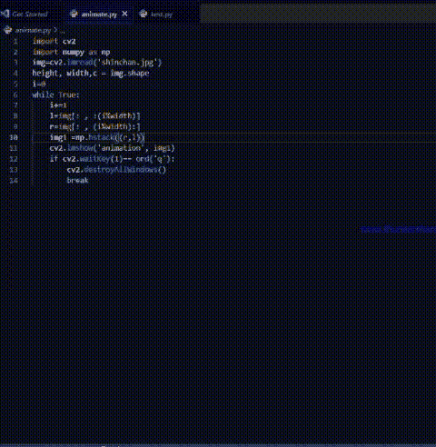

# 使用 Python 中的 OpenCV 制作图像动画

> 原文:[https://www . geesforgeks . org/animate-image-using-opencv-in-python/](https://www.geeksforgeeks.org/animate-image-using-opencv-in-python/)

在本文中，我们将讨论如何使用 python 的 OpenCV 模块制作图像动画。

假设我们有一个图像。使用单个图像，我们将动画化它，使它看起来像是同一图像的连续阵列。这在某些游戏的背景动画中很有用。例如，在一个 flappy 鸟游戏中，要使鸟看起来向前移动，背景需要向后移动。为了理解这一点，让我们首先考虑一个线性 python 列表。考虑一下下面的代码。

## 蟒蛇 3

```py
a = ['-', '-', '-', 1, '-', '-', '-']
n = len(a)  # length of the array

for i in range(2*n):
    # i is the index of the list a
    # i%n will have a value in range(0,n)
    # using slicing we can make the digit 1
    # appear to move across the list
    # this is similar to a cyclic list
    print(a[(i % n):]+a[:(i % n)])
```

**输出**:

```py
['-', '-', '-', 1, '-', '-', '-']
['-', '-', 1, '-', '-', '-', '-']
['-', 1, '-', '-', '-', '-', '-']
[1, '-', '-', '-', '-', '-', '-']
['-', '-', '-', '-', '-', '-', 1]
['-', '-', '-', '-', '-', 1, '-']
['-', '-', '-', '-', 1, '-', '-']
['-', '-', '-', 1, '-', '-', '-']
['-', '-', 1, '-', '-', '-', '-']
['-', 1, '-', '-', '-', '-', '-']
[1, '-', '-', '-', '-', '-', '-']
['-', '-', '-', '-', '-', '-', 1]
['-', '-', '-', '-', '-', 1, '-']
['-', '-', '-', '-', 1, '-', '-']
```

从上面的代码中，我们可以看到数字 1 的位置在变化，即索引在变化。这是我们将用于水平动画图像的原则。

我们将使用 NumPy 模块中的 [hstack()](https://www.geeksforgeeks.org/numpy-hstack-in-python/) 函数来连接两幅图像。hstack 函数将由数组顺序组成的元组作为参数，并用于水平(即按列)堆叠输入数组序列以形成单个数组。

**语法**:

```py
numpy.hstack((array1,array2))
```

**例**:

## 蟒蛇 3

```py
import cv2
import numpy as np

img = cv2.imread('shinchan.jpg')

height, width, c = img.shape

i = 0

while True:
    i += 1

    # divided the image into left and right part
    # like list concatenation we concatenated
    # right and left together
    l = img[:, :(i % width)]
    r = img[:, (i % width):]

    img1 = np.hstack((r, l))

    # this function will concatenate
    # the two matrices
    cv2.imshow('animation', img1)

    if cv2.waitKey(1) == ord('q'):

        # press q to terminate the loop
        cv2.destroyAllWindows()
        break
```

**输出**:

