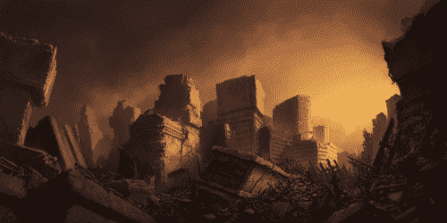
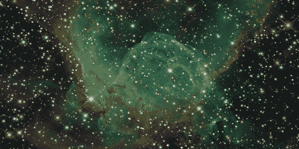
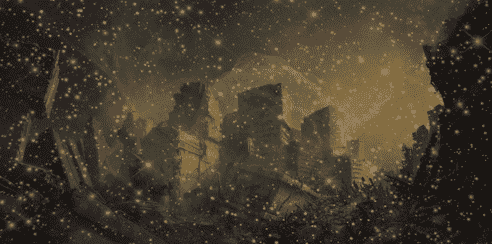

# 使用 OpenCV 对图像进行算术运算| Set-1(加法和减法)

> 原文:[https://www . geesforgeks . org/算术-图像运算-使用-opencv-set-1-加减/](https://www.geeksforgeeks.org/arithmetic-operations-on-images-using-opencv-set-1-addition-and-subtraction/)

加法、减法和按位运算(与、或、非、异或)等算术运算可以应用于输入图像。这些操作有助于增强输入图像的属性。图像算法对于分析输入图像的特性非常重要。被操作的图像可以进一步用作增强的输入图像，并且更多的操作可以被应用于图像的澄清、阈值化、扩张等。

### 添加图像:

我们可以使用功能 **cv2.add()** 添加两幅图像。这直接将两幅图像中的图像像素相加。

```py
Syntax: cv2.add(img1, img2)
```

但是增加像素并不是一个理想的情况。所以，我们使用 cv2.addweighted()。请记住，两幅图像的大小和深度应该相等。

> **语法** : cv2.addWeighted(img1、wt1、img2、wt2、gammaValue)
> **参数** :
> **img1** :第一输入图像数组(单通道、8 位或浮点)
> **wt1** :应用于最终图像的第一输入图像元素的权重
> **img2** :第二输入图像数组(单通道、8 位或浮点)

**用作输入的图像:**
输入图像 1:



输入图像 2:



下面是代码:

## 蟒蛇 3

```py
# Python program to illustrate
# arithmetic operation of
# addition of two images

# organizing imports
import cv2
import numpy as np

# path to input images are specified and 
# images are loaded with imread command
image1 = cv2.imread('input1.jpg')
image2 = cv2.imread('input2.jpg')

# cv2.addWeighted is applied over the
# image inputs with applied parameters
weightedSum = cv2.addWeighted(image1, 0.5, image2, 0.4, 0)

# the window showing output image
# with the weighted sum
cv2.imshow('Weighted Image', weightedSum)

# De-allocate any associated memory usage 
if cv2.waitKey(0) & 0xff == 27:
    cv2.destroyAllWindows()
```

**输出:**



### 图像相减:

就像加法一样，我们可以减去两幅图像中的像素值，并借助 cv2 .减法()将其合并。图像的大小和深度应该相等。

```py
Syntax:  cv2.subtract(src1, src2)
```

**用作输入的图像:**
输入图像 1:


输入图像 2:


下面是代码:

## 蟒蛇 3

```py
# Python program to illustrate
# arithmetic operation of
# subtraction of pixels of two images

# organizing imports
import cv2
import numpy as np

# path to input images are specified and 
# images are loaded with imread command
image1 = cv2.imread('input1.jpg')
image2 = cv2.imread('input2.jpg')

# cv2.subtract is applied over the
# image inputs with applied parameters
sub = cv2.subtract(image1, image2)

# the window showing output image
# with the subtracted image
cv2.imshow('Subtracted Image', sub)

# De-allocate any associated memory usage 
if cv2.waitKey(0) & 0xff == 27:
    cv2.destroyAllWindows()
```

**输出:**

