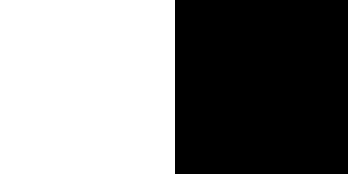
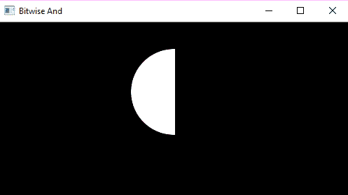
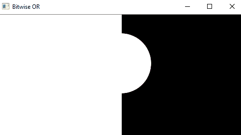
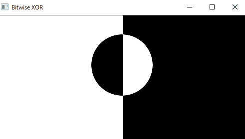
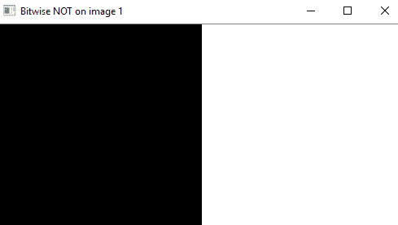
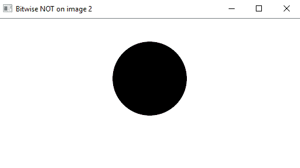

# 使用 OpenCV | Set-2 对图像进行算术运算(对二进制图像进行按位运算)

> 原文:[https://www . geeksforgeeks . org/算术-图像运算-使用-opencv-set-2-二进制图像按位运算/](https://www.geeksforgeeks.org/arithmetic-operations-on-images-using-opencv-set-2-bitwise-operations-on-binary-images/)

前提条件:[图像上的算术运算| Set-1](https://www.geeksforgeeks.org/arithmetic-operations-on-images-using-opencv-set-1-addition-and-subtraction/)
按位运算用于图像处理，用于提取图像中的基本部分。在本文中，使用的按位运算是:

1.  **和**
2.  **或**
3.  **异或**
4.  **不是**

此外，按位运算有助于图像屏蔽。在这些操作的帮助下，可以创建图像。这些操作有助于增强输入图像的属性。
**注意:**位运算应该应用于相同维度的输入图像
**输入图像 1:**



**输入图像 2:**


### 图像上的按位“与”运算:

输入数组元素的逐位连接。

> **语法:** cv2.bitwise_and(source1，source2，destination，mask)
> **参数:**
> **source1:** 第一个输入图像数组(单通道、8 位或浮点)
> **source2:** 第二个输入图像数组(单通道、8 位或浮点)
> **dest:** 输出数组(与输入图像数组的维度和类型类似)
> 【T15

## 蟒蛇 3

```py
# Python program to illustrate
# arithmetic operation of
# bitwise AND of two images

# organizing imports
import cv2
import numpy as np

# path to input images are specified and  
# images are loaded with imread command 
img1 = cv2.imread('input1.png') 
img2 = cv2.imread('input2.png')

# cv2.bitwise_and is applied over the
# image inputs with applied parameters
dest_and = cv2.bitwise_and(img2, img1, mask = None)

# the window showing output image
# with the Bitwise AND operation
# on the input images
cv2.imshow('Bitwise And', dest_and)

# De-allocate any associated memory usage 
if cv2.waitKey(0) & 0xff == 27:
    cv2.destroyAllWindows()
```

**输出:**



### 图像上的按位“或”运算:

输入数组元素的逐位析取。

> **语法:** cv2.bitwise_or(source1，source2，destination，mask)
> **参数:**
> **source1:** 第一个输入图像数组(单通道、8 位或浮点)
> **source2:** 第二个输入图像数组(单通道、8 位或浮点)
> **dest:** 输出数组(与输入图像数组的维度和类型类似)
> 【T15

## 蟒蛇 3

```py
# Python program to illustrate
# arithmetic operation of
# bitwise OR of two images

# organizing imports
import cv2
import numpy as np

# path to input images are specified and  
# images are loaded with imread command 
img1 = cv2.imread('input1.png') 
img2 = cv2.imread('input2.png')

# cv2.bitwise_or is applied over the
# image inputs with applied parameters
dest_or = cv2.bitwise_or(img2, img1, mask = None)

# the window showing output image
# with the Bitwise OR operation
# on the input images
cv2.imshow('Bitwise OR', dest_or)

# De-allocate any associated memory usage 
if cv2.waitKey(0) & 0xff == 27:
    cv2.destroyAllWindows()
```

**输出:**



### 图像的逐位异或运算:

输入数组元素的逐位异或运算。

> **语法:** cv2.bitwise_xor(source1，source2，destination，mask)
> **参数:**
> **source1:** 第一个输入图像数组(单通道、8 位或浮点)
> **source2:** 第二个输入图像数组(单通道、8 位或浮点)
> **dest:** 输出数组(与输入图像数组的维度和类型类似)
> 【T15

## 蟒蛇 3

```py
# Python program to illustrate
# arithmetic operation of
# bitwise XOR of two images

# organizing imports
import cv2
import numpy as np

# path to input images are specified and  
# images are loaded with imread command 
img1 = cv2.imread('input1.png') 
img2 = cv2.imread('input2.png')

# cv2.bitwise_xor is applied over the
# image inputs with applied parameters
dest_xor = cv2.bitwise_xor(img1, img2, mask = None)

# the window showing output image
# with the Bitwise XOR operation
# on the input images
cv2.imshow('Bitwise XOR', dest_xor)

# De-allocate any associated memory usage 
if cv2.waitKey(0) & 0xff == 27:
    cv2.destroyAllWindows()
```

**输出:**



### 图像上的按位非运算:

输入数组元素的反转。

> **语法:** cv2.bitwise_not(源、目标、掩码)
> **参数:**
> **源:**输入图像数组(单通道、8 位或浮点)
> **dest:** 输出数组(类似于输入图像数组的维度和类型)
> **掩码:**操作掩码，输入/输出 8 位单通道掩码

## 蟒蛇 3

```py
# Python program to illustrate
# arithmetic operation of
# bitwise NOT on input image

# organizing imports
import cv2
import numpy as np

# path to input images are specified and  
# images are loaded with imread command 
img1 = cv2.imread('input1.png') 
img2 = cv2.imread('input2.png')

# cv2.bitwise_not is applied over the
# image input with applied parameters
dest_not1 = cv2.bitwise_not(img1, mask = None)
dest_not2 = cv2.bitwise_not(img2, mask = None)

# the windows showing output image
# with the Bitwise NOT operation
# on the 1st and 2nd input image
cv2.imshow('Bitwise NOT on image 1', dest_not1)
cv2.imshow('Bitwise NOT on image 2', dest_not2)

# De-allocate any associated memory usage 
if cv2.waitKey(0) & 0xff == 27:
    cv2.destroyAllWindows()
```

**输出:**
**在图像 1 上按位“否”**



**图像 2 上的按位非**

