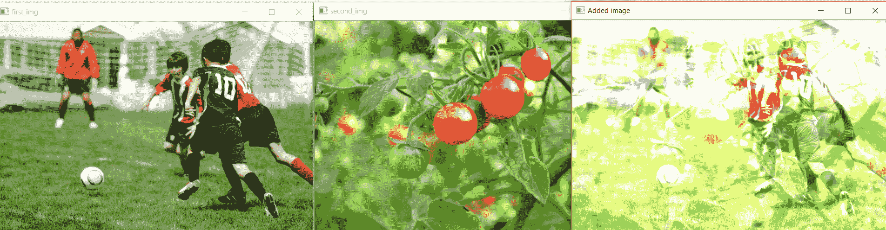
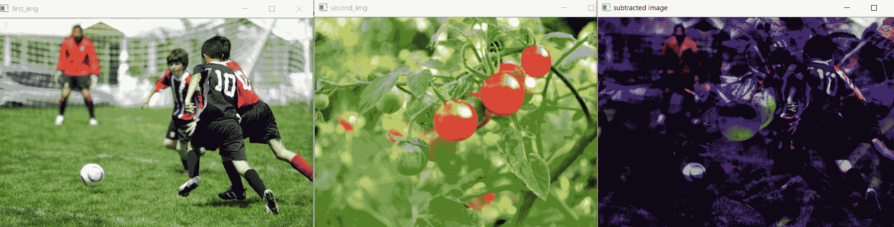

# 使用 OpenCV | Python 的算术运算

> 原文:[https://www . geesforgeks . org/算术-运算-使用-opencv-python/](https://www.geeksforgeeks.org/arithmetic-operations-using-opencv-python/)

先决条件:[使用 OpenCV 对图像进行算术运算|基础知识](https://www.geeksforgeeks.org/arithmetic-operations-on-images-using-opencv-set-1-addition-and-subtraction/)

我们可以对图像进行不同的算术运算，例如加法、减法等。这是可能的，因为图像实际上是作为阵列存储的(对于 RGB 图像是三维的，对于灰度图像是一维的)。

**图像算术运算的重要性:**

*   **图像混合:**图像的添加用于图像混合，其中图像被乘以不同的权重并被添加在一起以给出混合效果。
*   **水印:**它也是基于极低权重的图像添加到原始图像的添加原理。
*   **检测图像中的变化:**图像相减有助于识别两幅图像中的变化，并使图像的不平坦部分变平，例如处理图像上有阴影的一半部分。

**图像添加代码–**

```py
import  cv2
import matplotlib.pyplot as plt % matplotlib inline
# matplotlib can be used to plot the images as subplot

first_img = cv2.imread("C://gfg//image_processing//players.jpg")
second_img = cv2.imread("C://gfg//image_processing//tomatoes.jpg")

print(first_img.shape)
print(second_img.shape)

# we need to resize, as they differ in shape
dim =(544, 363)
resized_second_img = cv2.resize(second_img, dim, interpolation = cv2.INTER_AREA)
print("shape after resizing", resized_second_img.shape)

added_img = cv2.add(first_img, resized_second_img)

cv2.imshow("first_img", first_img)
cv2.waitKey(0)
cv2.imshow("second_img", resized_second_img)
cv2.waitKey(0)
cv2.imshow("Added image", added_img)
cv2.waitKey(0)

cv2.destroyAllWindows()
```

**输出:**
(363，544，3)
(500，753，3)
调整大小后的形状(363，544，3)


**图像减法代码–**

```py
import  cv2
import matplotlib.pyplot as plt % matplotlib inline

first_img = cv2.imread("C://gfg//image_processing//players.jpg")
second_img = cv2.imread("C://gfg//image_processing//tomatoes.jpg")

print(first_img.shape)
print(second_img.shape)

# we need to resize, as they differ in shape
dim =(544, 363)
resized_second_img = cv2.resize(second_img, dim, interpolation = cv2.INTER_AREA)
print("shape after resizing", resized_second_img.shape)

subtracted = cv2.subtract(first_img, resized_second_img)
cv2.imshow("first_img", first_img)
cv2.waitKey(0)
cv2.imshow("second_img", resized_second_img)
cv2.waitKey(0)
cv2.imshow("subtracted image", subtracted)
cv2.waitKey(0)

cv2.destroyAllWindows()
```

**输出:**
(363，544，3)
(500，753，3)
调整大小后的形状(363，544，3)
