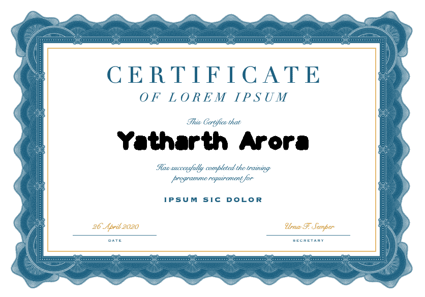

# Python 中使用 Opencv 的自动证书生成器

> 原文:[https://www . geesforgeks . org/automatic-certificate-generator-use-opencv-in-python/](https://www.geeksforgeeks.org/automated-certificate-generator-using-opencv-in-python/)

**先决条件:**[OpenCV 简介](https://www.geeksforgeeks.org/introduction-to-opencv/)

OpenCV 是用于计算机视觉、机器学习和图像处理的巨大开源库，现在它在实时操作中发挥着重要作用，这在当今的系统中非常重要。通过使用它，人们可以处理图像和视频来识别物体、人脸，甚至是人类的笔迹。

任何活动通常都涉及许多参与者，为每个参与者生成手写证书并以数字方式发送是一项非常乏味的任务。自动化这项工作可以很容易地节省大量的时间和人工工作，从而也降低了错误率。这个 Python 脚本生成带有人名的证书，在脚本中加载模板证书后从 excel 文件中读取。

下面是实现。

**证书模板:**


```py
#import the necessary libraries</pre>

import cv2 as cv
import openpyxl

# template1.png is the template
# certificate
template_path = 'template12.png'

# Excel file containing names of 
# the participants
details_path = 'gsocOrgsList.xlsx'

# Output Paths
output_path = '/home/nikhil/Desktop/gfg'

# Setting the font size and font
# colour
font_size = 3
font_color = (0,0,0)

# Coordinates on the certificate where
# will be printing the name (set
# according to your own template)
coordinate_y_adjustment = 15
coordinate_x_adjustment = 7

# loading the details.xlsx workbook 
# and grabbing the active sheet
obj = openpyxl.load_workbook(details_path)
sheet = obj.active

# printing for the first 10 names in the
# excel sheet
for i in range(1,11):

    # grabs the row=i and column=1 cell 
    # that contains the name value of that
    # cell is stored in the variable certi_name
    get_name = sheet.cell(row = i ,column = 1)
    certi_name = get_name.value

    # read the certificate template
    img = cv.imread(template_path)

    # choose the font from opencv
    font = cv.FONT_HERSHEY_PLAIN              

    # get the size of the name to be
    # printed
    text_size = cv.getTextSize(certi_name, font, font_size, 10)[0]     

    # get the (x,y) coordinates where the
    # name is to written on the template
    # The function cv.putText accepts only
    # integer arguments so convert it into 'int'.
    text_x = (img.shape[1] - text_size[0]) / 2 + coordinate_x_adjustment 
    text_y = (img.shape[0] + text_size[1]) / 2 - coordinate_y_adjustment
    text_x = int(text_x)
    text_y = int(text_y)
    cv.putText(img, certi_name,
              (text_x ,text_y ), 
              font,
              font_size,
              font_color, 10)

    # Output path along with the name of the
    # certificate generated
    certi_path = output_path + '/certi' + '.png'

    # Save the certificate                      
    cv.imwrite(certi_path,img)
```

**输出:**

