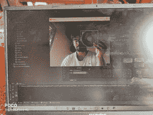

# 通过颜色检测使用 Python-Opencv 自动滚动

> 原文:[https://www . geesforgeks . org/automation-scrolling-use-python-opencv-by-color-detection/](https://www.geeksforgeeks.org/automating-scrolling-using-python-opencv-by-color-detection/)

**先决条件:**

*   [Opencv](https://www.geeksforgeeks.org/opencv-python-tutorial/)
*   [pyautoui](https://www.geeksforgeeks.org/mouse-keyboard-automation-using-python/)

可以在不通过触摸板或鼠标实际输入的情况下执行操作。本文讨论如何使用 opencv 模块来实现这一点。这里我们将使用颜色检测来滚动屏幕。当程序在执行过程中检测到某种颜色时，屏幕开始自动滚动。

### 方法

*   导入模块
*   使用 cv2 捕捉视频，这里使用默认网络摄像头使用 0，对于任何其他摄像头使用 1。
*   读取捕获的视频并将视频帧存储在变量中
*   获取框架的每种颜色。
*   使用可接受的颜色范围创建一个所需颜色的遮罩作为滚动的输入。这里它被认为是绿色的。
*   从遮罩获取轮廓和层次
*   传递用于循环的等高线并计算面积。
*   检测到所需颜色时添加滚动机制(此处为绿色)。
*   使用 cv2.imshow()显示帧，并传递帧名和帧变量来显示每个捕获的帧，将帧捕获过程置于 while 循环中。要退出该过程，请使用等待键和 break 语句。
*   然后关闭网络摄像头的窗口。

下面是实现。

## 蟒蛇 3

```py
import cv2
import numpy as np
import pyautogui

low_green = np.array([25, 52, 72])
high_green = np.array([102, 255, 255])

cap = cv2.VideoCapture(0)

prev_y = 0

while True:
    ret, frame = cap.read()
    hsv = cv2.cvtColor(frame, cv2.COLOR_BGR2HSV)
    mask = cv2.inRange(hsv, low_green, high_green)
    contours, hierarchy = cv2.findContours(
        mask, cv2.RETR_EXTERNAL, cv2.CHAIN_APPROX_SIMPLE)

    for i in contours:
        area = cv2.contourArea(i)
        if area > 1000:
            x, y, w, h = cv2.boundingRect(i)
            cv2.rectangle(frame, (x, y), (x+w, y+h), (0, 255, 0), 2)
            if y < prev_y:
                pyautogui.press('space')
            prev_y = y
    cv2.imshow('frame', frame)
    if cv2.waitKey(1) == ord('q'):
        break

cap.release()
cap.closeAllWindow()
```

**输入:**



检测绿色

<video class="wp-video-shortcode" id="video-534623-1" width="640" height="360" preload="metadata" controls=""><source type="video/mp4" src="https://media.geeksforgeeks.org/wp-content/uploads/20201231100220/op.mp4?_=1">[https://media.geeksforgeeks.org/wp-content/uploads/20201231100220/op.mp4](https://media.geeksforgeeks.org/wp-content/uploads/20201231100220/op.mp4)</video>