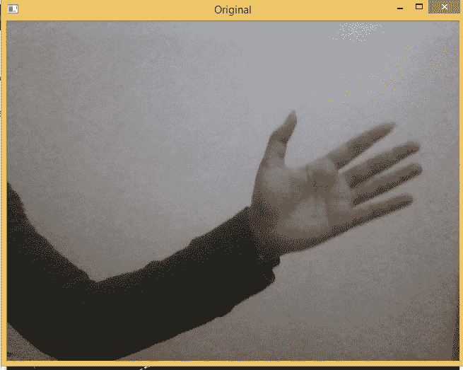
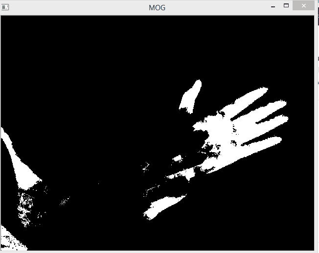
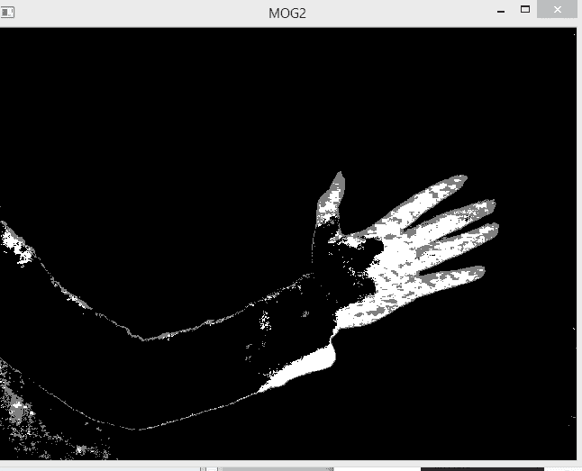
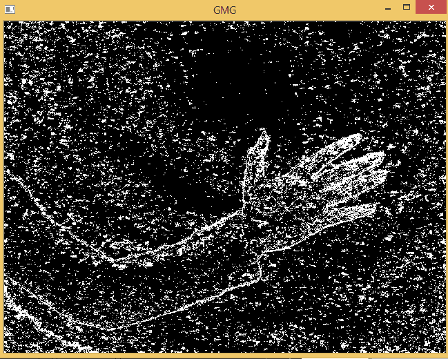
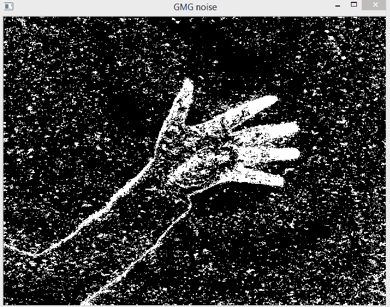
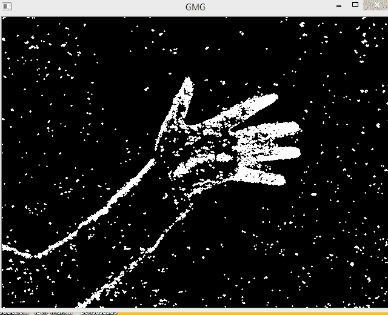

# 背景减法–OpenCV

> 原文:[https://www . geesforgeks . org/background-减法-opencv/](https://www.geeksforgeeks.org/background-subtraction-opencv/)

背景减除是一种从图像中消除背景的方法。为此，我们从静态背景中提取运动前景。

背景减除在日常生活中有几个使用案例，它被用于对象分割、安全增强、行人跟踪、统计访客数量、交通中的车辆数量等。它能够学习和识别前景遮罩。

**在 OpenCV 中，我们有 3 个算法来完成这个操作–**

> **背景减法图–**这是一种基于高斯混合的背景/前景分割算法。
> 
> 【Background 减法公式 2–也是一种基于高斯混合的背景/前景分割算法。它提供了更好的适应因光照变化等变化的场景。
> 
> **背景差分算法–**该算法结合了统计背景图像估计和逐像素贝叶斯分割。

如何将 OpenCV 内置函数应用于背景减除–
**步骤# 1–**创建一个对象来表示我们用于背景减除的算法。
**步骤# 2–**在图像上应用`backgroundsubtractor.apply()`功能。

Below is the Python implementation for Background subtraction –

```py
# importing libraries
import numpy as np
import cv2

# creating object
fgbg1 = cv2.bgsegm.createBackgroundSubtractorMOG();   
fgbg2 = cv2.createBackgroundSubtractorMOG2();
fgbg3 = cv2.bgsegm.createBackgroundSubtractorGMG();

# capture frames from a camera 
cap = cv2.VideoCapture(0);
while(1):
    # read frames
    ret, img = cap.read();

    # apply mask for background subtraction
    fgmask1 = fgbg1.apply(img);
    fgmask2 = fgbg2.apply(img);
    fgmask3 = fgbg3.apply(img);

    cv2.imshow('Original', img);
    cv2.imshow('MOG', fgmask1);
    cv2.imshow('MOG2', fgmask2);
    cv2.imshow('GMG', fgmask3);
    k = cv2.waitKey(30) & 0xff;
    if k == 27:
        break;

cap.release();
cv2.destroyAllWindows();
```

**输出:**








我们可以看到`BackgroundSubtractorGMG`的合成图像中有很多噪声，因此总是倾向于对结果使用形态学变换来去除噪声。

```py
# importing libraries
import numpy as np
import cv2

kernel = cv2.getStructuringElement(cv2.MORPH_ELLIPSE, (3, 3));

# creating object
fgbg = cv2.bgsegm.createBackgroundSubtractorGMG();

# capture frames from a camera 
cap = cv2.VideoCapture(0);
while(1):
    # read frames
    ret, img = cap.read();

    # apply mask for background subtraction
    fgmask = fgbg.apply(img);

    # with noise frame
    cv2.imshow('GMG noise', fgmask);

    # apply transformation to remove noise
    fgmask = cv2.morphologyEx(fgmask, cv2.MORPH_OPEN, kernel);

    # after removing noise
    cv2.imshow('GMG', fgmask);

    k = cv2.waitKey(30) & 0xff;
    if k == 27:
        break;

cap.release();
cv2.destroyAllWindows();
```

**输出:**


