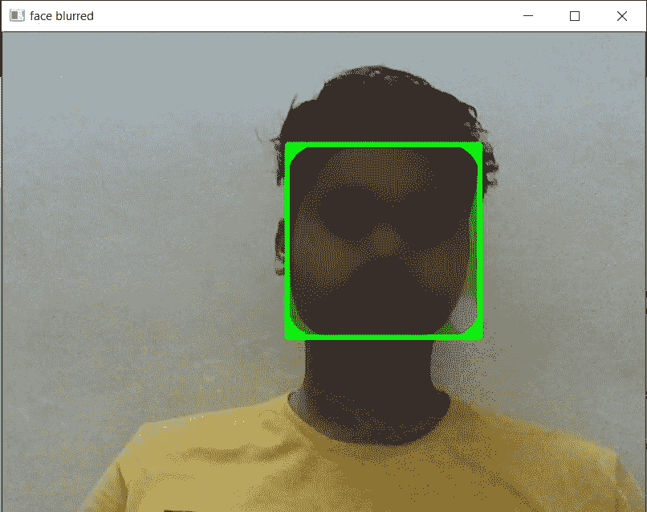

# 用 OpenCV 和 Python 模糊和匿名化人脸

> 原文:[https://www . geesforgeks . org/blur-and-anonymeze-face-with-opencv-and-python/](https://www.geeksforgeeks.org/blur-and-anonymize-faces-with-opencv-and-python/)

在本文中，我们将看到如何使用 OpenCV 和 Python 来模糊和匿名化人脸。

为此，我们将使用级联分类器来检测人脸。请务必从以下链接下载相同的内容:[haarcscade _ frontal face _ default . XML](https://drive.google.com/file/d/1PPO2MCttsmSqyB-vKh5C7SumwFKuhgyj/view?usp=sharing)

## 方法

*   首先，我们使用一种内置的人脸检测算法，从实时视频或图像中检测人脸。这里，我们将使用级联分类器方法从实时视频中检测人脸(使用网络摄像头)。
*   然后，读取实时视频中的帧。存储最新帧并将其转换为灰度，以便更好地理解特征。
*   现在，为了使输出美观，我们将在检测到的人脸周围制作一个彩色边框。但是，我们希望检测到的人脸是模糊的，所以我们使用 medianBlur 功能来做同样的事情，并提到区域，直到面部应该是模糊的。
*   现在，我们想显示模糊的脸，使用 imshow 功能读取的帧，我们想显示它，直到我们按下一个键。

## **分步实施:**

**第一步:**导入人脸检测算法，称为级联分类器。

## 蟒蛇 3

```py
import cv2

# to detect the face of the human
cascade = cv2.CascadeClassifier("haarcascade_frontalface_default.xml")
```

**步骤 2:** 从视频中捕捉帧，以便从帧中检测人脸

## 蟒蛇 3

```py
video_capture = cv2.VideoCapture(0)
while True:

    # capture the latest frame from the video
    check, frame = video_capture.read()
```

**第 3 步:**将捕捉到的帧更改为灰度。

## 蟒蛇 3

```py
# convert the frame into grayscale(shades of black & white)
gray_image = cv2.cvtColor(frame, cv2.COLOR_BGR2GRAY)
face = cascade.detectMultiScale(gray_image,
                                scaleFactor=2.0,
                                minNeighbors=4)
```

**第四步:**在检测到的人脸周围画一个彩色矩形。

## 蟒蛇 3

```py
for x, y, w, h in face:

    # draw a border around the detected face.
    # (here border color = green, and thickness = 3)
    image = cv2.rectangle(frame, (x, y),
                          (x+w, y+h), 
                          (0, 255, 0), 3)
```

**步骤 5:** 模糊矩形内的部分(包含检测到的人脸)。

## 蟒蛇 3

```py
# blur the face which is in the rectangle
image[y:y+h, x:x+w] = cv2.medianBlur(image[y:y+h, x:x+w], 35)
```

**第 6 步:**显示最终输出，即检测到的人脸(矩形内)模糊。

## 蟒蛇 3

```py
# show the blurred face in the video
cv2.imshow('face blurred', frame)
key = cv2.waitKey(1)
```

**下面是完整的实现:**

## 蟒蛇 3

```py
import cv2

# to detect the face of the human
cascade = cv2.CascadeClassifier("haarcascade_frontalface_default.xml")

# VideoCapture is a function, to capture
# video from the camera attached to system
# You can pass either 0 or 1
# 0 for laptop webcam
# 1 for external webcam
video_capture = cv2.VideoCapture(0)

# a while loop to run infinite times,
# to capture infinite number of frames for video
# because a video is a combination of frames
while True:

    # capture the latest frame from the video
    check, frame = video_capture.read()

    # convert the frame into grayscale(shades of black & white)
    gray_image = cv2.cvtColor(frame, cv2.COLOR_BGR2GRAY)

    # detect multiple faces in a captured frame
    # scaleFactor: Parameter specify how much the
    # image sizeis reduced at each image scale.
    # minNeighbors: Parameter specify how many
    # neighbours each rectangle should have to retain it.
    # rectangle consists the detect object.
    # Here the object is the face.
    face = cascade.detectMultiScale(
        gray_image, scaleFactor=2.0, minNeighbors=4)

    for x, y, w, h in face:

        # draw a border around the detected face. 
        # (here border color = green, and thickness = 3)
        image = cv2.rectangle(frame, (x, y), (x+w, y+h), 
                              (0, 255, 0), 3)

        # blur the face which is in the rectangle
        image[y:y+h, x:x+w] = cv2.medianBlur(image[y:y+h, x:x+w],
                                             35)

    # show the blurred face in the video
    cv2.imshow('face blurred', frame)
    key = cv2.waitKey(1)

    # This statement just runs once per frame.
    # Basically, if we get a key, and that key is a q,
    if key == ord('q'):
        break

# we will exit the while loop with a break,
# which then runs:
video_capture.release()
cv2.destroyAllWindows()
```

**输出:**

