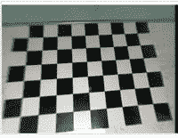
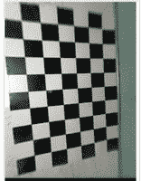
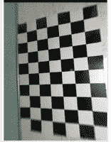

# 使用 Python–OpenCV 进行摄像机校准

> 原文:[https://www . geesforgeks . org/camera-calibration-with-python-opencv/](https://www.geeksforgeeks.org/camera-calibration-with-python-opencv/)

**先决条件:** [OpenCV](https://www.geeksforgeeks.org/introduction-to-opencv/)

相机是机器人、太空探索等多个领域不可或缺的一部分，相机发挥着重要作用。它有助于捕捉每一个时刻，并有助于许多分析。为了将摄像机用作视觉传感器，我们应该知道摄像机的参数。**相机校准**无非是估计相机的参数，需要关于相机的参数来确定现实世界中的 3D 点与其在该校准相机捕获的图像中的相应 2D 投影(像素)之间的精确关系。

我们需要同时考虑焦距、光学中心和透镜径向畸变系数等内部参数。，以及外部参数，如相机相对于某个真实世界坐标系的旋转和平移。

### **所需库:**

*   [**python 中的 OpenCV**](https://www.geeksforgeeks.org/opencv-python-tutorial/) 库是一个计算机视觉库，主要用于图像处理、视频处理，以及分析、面部识别和检测等。
*   [**Numpy**](https://www.geeksforgeeks.org/numpy-in-python-set-1-introduction/) 是一个通用的数组处理包。它提供了一个高性能多维数组对象和使用这些数组的工具。

### **摄像机校准可以逐步进行:**

*   **步骤 1:** 首先使用已知尺寸的棋盘图案定义 3D 点的真实世界坐标。
*   **第二步:**捕捉棋盘图像的不同视点。
*   **第三步:***find chesboardcorners()*是 *OpenCV* 中的一种方法，用于为不同图像中的每个 3D 点寻找像素坐标 *(u，v)*
*   **第四步:**然后用*标定摄像机()*方法寻找摄像机参数。

它将把我们计算出的*(三点，两点，gray color . shape[:-1]，无，无)*作为参数，并返回一个列表，该列表包含的元素有*摄像机矩阵、失真系数、旋转矢量*和*平移矢量。*

*相机矩阵*帮助将 3D 对象点转换为 2D 图像点，*失真系数*返回相机在世界上的位置，值为*旋转*和*平移*矢量

**以下是上述方法的完整程序:**

## 蟒蛇 3

```py
# Import required modules
import cv2
import numpy as np
import os
import glob

# Define the dimensions of checkerboard
CHECKERBOARD = (6, 9)

# stop the iteration when specified
# accuracy, epsilon, is reached or
# specified number of iterations are completed.
criteria = (cv2.TERM_CRITERIA_EPS +
            cv2.TERM_CRITERIA_MAX_ITER, 30, 0.001)

# Vector for 3D points
threedpoints = []

# Vector for 2D points
twodpoints = []

#  3D points real world coordinates
objectp3d = np.zeros((1, CHECKERBOARD[0]
                      * CHECKERBOARD[1],
                      3), np.float32)
objectp3d[0, :, :2] = np.mgrid[0:CHECKERBOARD[0],
                               0:CHECKERBOARD[1]].T.reshape(-1, 2)
prev_img_shape = None

# Extracting path of individual image stored
# in a given directory. Since no path is
# specified, it will take current directory
# jpg files alone
images = glob.glob('*.jpg')

for filename in images:
    image = cv2.imread(filename)
    grayColor = cv2.cvtColor(image, cv2.COLOR_BGR2GRAY)

    # Find the chess board corners
    # If desired number of corners are
    # found in the image then ret = true
    ret, corners = cv2.findChessboardCorners(
                    grayColor, CHECKERBOARD,
                    cv2.CALIB_CB_ADAPTIVE_THRESH
                    + cv2.CALIB_CB_FAST_CHECK +
                    cv2.CALIB_CB_NORMALIZE_IMAGE)

    # If desired number of corners can be detected then,
    # refine the pixel coordinates and display
    # them on the images of checker board
    if ret == True:
        threedpoints.append(objectp3d)

        # Refining pixel coordinates
        # for given 2d points.
        corners2 = cv2.cornerSubPix(
            grayColor, corners, (11, 11), (-1, -1), criteria)

        twodpoints.append(corners2)

        # Draw and display the corners
        image = cv2.drawChessboardCorners(image,
                                          CHECKERBOARD,
                                          corners2, ret)

    cv2.imshow('img', image)
    cv2.waitKey(0)

cv2.destroyAllWindows()

h, w = image.shape[:2]

# Perform camera calibration by
# passing the value of above found out 3D points (threedpoints)
# and its corresponding pixel coordinates of the
# detected corners (twodpoints)
ret, matrix, distortion, r_vecs, t_vecs = cv2.calibrateCamera(
    threedpoints, twodpoints, grayColor.shape[::-1], None, None)

# Displaying required output
print(" Camera matrix:")
print(matrix)

print("\n Distortion coefficient:")
print(distortion)

print("\n Rotation Vectors:")
print(r_vecs)

print("\n Translation Vectors:")
print(t_vecs)
```

**输入:**

  

**输出:**

```py
 Camera matrix: 
[[ 36.26378216   0\.         125.68539168]
 [  0\.          36.76607372 142.49821147]
 [  0\.           0\.           1\.        ]]

 Distortion coefficient: 
[[-1.25491812e-03  9.89269357e-05 -2.89077718e-03  4.52760939e-04
  -3.29964245e-06]]

 Rotation Vectors: 
[array([[-0.05767492],
       [ 0.03549497],
       [ 1.50906953]]), array([[-0.09301982],
       [-0.01034321],
       [ 3.07733805]]), array([[-0.02175332],
       [ 0.05611105],
       [-0.07308161]])]

 Translation Vectors: 
[array([[ 4.63047351],
       [-3.74281386],
       [ 1.64238108]]), array([[2.31648737],
       [3.98801521],
       [1.64584622]]), array([[-3.17548808],
       [-3.46022466],
       [ 1.68200157]])]
```