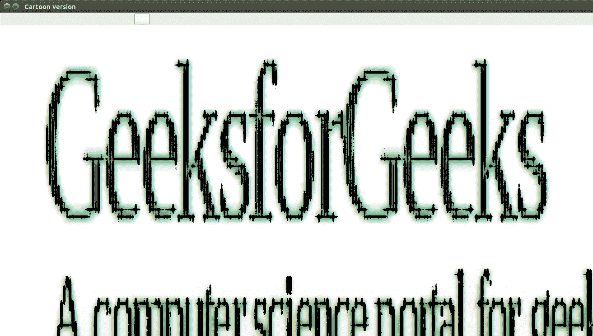
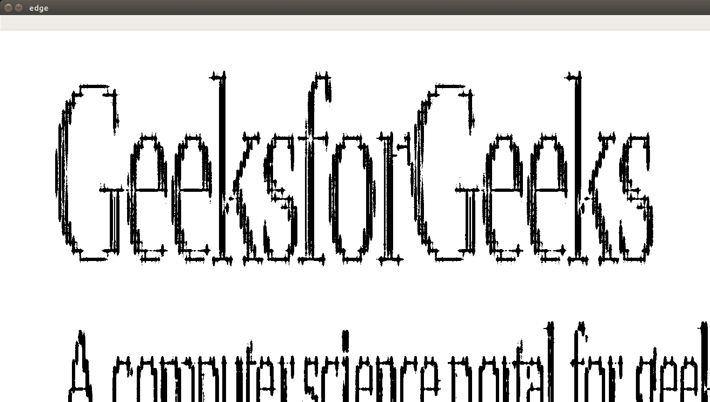

# 使用 OpenCV–Python 绘制图像

> 原文:[https://www . geesforgeks . org/cartoning-an-image-use-opencv-python/](https://www.geeksforgeeks.org/cartooning-an-image-using-opencv-python/)

正如你所知(或者即使你不知道)，计算机视觉是一个非常强大的工具，具有巨大的可能性。所以，当我准备为我一个朋友的大学生活画一幅漫画时，我很快意识到我需要一些东西来减少我真正画它的努力，但会保持质量，我想出了以下解决方案。

让我们先看看结果–

 **原图**



**漫画版**



**从图像获得的边缘(自适应阈值结果)**

让我们看看代码:

```
class Cartoonizer: 
    """Cartoonizer effect 
        A class that applies a cartoon effect to an image. 
        The class uses a bilateral filter and adaptive thresholding to create 
        a cartoon effect. 
    """
    def __init__(self): 
        pass

    def render(self, img_rgb): 
        img_rgb = cv2.imread(img_rgb) 
        img_rgb = cv2.resize(img_rgb, (1366,768)) 
        numDownSamples = 2     # number of downscaling steps 
        numBilateralFilters = 50 # number of bilateral filtering steps 

        # -- STEP 1 -- 

        # downsample image using Gaussian pyramid 
        img_color = img_rgb 
        for _ in range(numDownSamples): 
            img_color = cv2.pyrDown(img_color) 

        #cv2.imshow("downcolor",img_color) 
        #cv2.waitKey(0) 
        # repeatedly apply small bilateral filter instead of applying 
        # one large filter 
        for _ in range(numBilateralFilters): 
            img_color = cv2.bilateralFilter(img_color, 9, 9, 7) 

        #cv2.imshow("bilateral filter",img_color) 
        #cv2.waitKey(0) 
        # upsample image to original size 
        for _ in range(numDownSamples): 
            img_color = cv2.pyrUp(img_color) 
        #cv2.imshow("upscaling",img_color) 
        #cv2.waitKey(0) 

        # -- STEPS 2 and 3 -- 
        # convert to grayscale and apply median blur 
        img_gray = cv2.cvtColor(img_rgb, cv2.COLOR_RGB2GRAY) 
        img_blur = cv2.medianBlur(img_gray, 3) 
        #cv2.imshow("grayscale+median blur",img_color) 
        #cv2.waitKey(0) 

        # -- STEP 4 -- 
        # detect and enhance edges 
        img_edge = cv2.adaptiveThreshold(img_blur, 255, 
                                        cv2.ADAPTIVE_THRESH_MEAN_C, 
                                        cv2.THRESH_BINARY, 9, 2) 
        #cv2.imshow("edge",img_edge) 
        #cv2.waitKey(0) 

        # -- STEP 5 -- 
        # convert back to color so that it can be bit-ANDed with color image 
        (x,y,z) = img_color.shape 
        img_edge = cv2.resize(img_edge,(y,x)) 
        img_edge = cv2.cvtColor(img_edge, cv2.COLOR_GRAY2RGB) 
        cv2.imwrite("edge.png",img_edge) 
        #cv2.imshow("step 5", img_edge) 
        #cv2.waitKey(0) 
        #img_edge = cv2.resize(img_edge,(i for i in img_color.shape[:2])) 
        #print img_edge.shape, img_color.shape 
        return cv2.bitwise_and(img_color, img_edge) 

tmp_canvas = Cartoonizer() 

file_name = "Screenshot.png" #File_name will come here 
res = tmp_canvas.render(file_name) 

cv2.imwrite("Cartoon version.jpg", res) 
cv2.imshow("Cartoon version", res) 
cv2.waitKey(0) 
cv2.destroyAllWindows() 
```

**说明:**

基本上，我们将使用一系列过滤器和图像转换。

*   首先，我们缩小图像，然后应用双边滤波器，以获得卡通的味道。然后我们再次升级图像。
*   下一步是获得原始图像的模糊版本。现在，我们不希望颜色干扰这个过程。我们只想模糊界限。为此，我们首先将图像转换为灰度，然后应用媒体模糊过滤器。
*   下一步是识别图像中的边缘，然后将其添加到先前修改的图像中，以获得草图笔效果。首先，我们使用自适应阈值。你也可以尝试其他类型的阈值技术。因为计算机视觉是关于实验的。在第 5 步中，我们编译从前面步骤中获得的最终图像。

## 更简单的实施–

```
# importing libraries
import cv2
import numpy as np

# reading image 
img = cv2.imread("koala.jpeg")

# Edges
gray = cv2.cvtColor(img, cv2.COLOR_BGR2GRAY)
gray = cv2.medianBlur(gray, 5)
edges = cv2.adaptiveThreshold(gray, 255, cv2.ADAPTIVE_THRESH_MEAN_C, 
                                         cv2.THRESH_BINARY, 9, 9)

# Cartoonization
color = cv2.bilateralFilter(img, 9, 250, 250)
cartoon = cv2.bitwise_and(color, color, mask=edges)

cv2.imshow("Image", img)
cv2.imshow("edges", edges)
cv2.imshow("Cartoon", cartoon)
cv2.waitKey(0)
cv2.destroyAllWindows()
```

**你能做什么？**
实验！尝试改变下采样步长，或应用的双边滤波器的数量，甚至滤波器的大小，或阈值技术来获得边缘。现在，有一件事要记住。这个过程是一个通用的过程，对于不同的图像不会给出最好的结果。这就是为什么，你应该尝试不同的价值观，以获得整个过程的感觉。

那都是从我这边来的！再见！

**关于作者:**

**维斯韦什·施里马里**是 BITS Pilani 的机械工程本科生。他满足了所有在他的分支机构没有教过的要求——白帽黑客、网络安全操作员和前竞争性程序员。作为 Python 力量的坚定信仰者，他的大部分作品都是同一种语言。每当他除了编程、上课、看 CSI Cyber 之外有时间的时候，他都会去散步，默默地弹吉他。他的人生格言是——“享受你的生活，因为它值得享受！”

**如果你也想在这里展示你的博客，请查看[博客](http://geeksquiz.com/gblog/)在极客博客上的客座博文。**