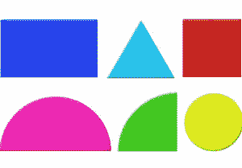
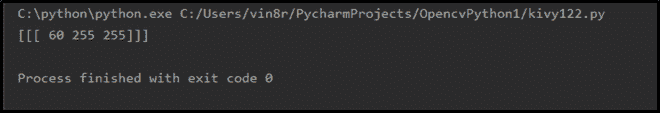

# 使用 Python-OpenCV 进行图像中的颜色识别

> 原文:[https://www . geesforgeks . org/color-identificati on-in-images-use-python-opencv/](https://www.geeksforgeeks.org/color-identification-in-images-using-python-opencv/)

Python 中的一个开源库， **OpenCV** 基本用于图像和视频处理。不仅任何系统都支持，比如 Windows、Linux、Mac 等。而且可以用 Python、C++、Java 等任何编程语言运行。OpenCV 还允许您识别图像中的颜色。你不知道如何在图像中找到这些颜色吗？

## **图像中的颜色识别**

显示器或电视屏幕基本上会产生三种颜色，即红色、绿色和黄色。但是这三种颜色的组合和强度形成了不同的颜色。因此，每种颜色都有其独特的 **HSV 色码**。为了在给定的图像中找到指定的颜色，我们需要使用该颜色的下限和上限。

**例:**为了在图像中找到绿色，我们需要为绿色指定 HSV 颜色的上下色码，如下所示。

```py
lower=np.array([50, 100,100])
upper=np.array([70, 255, 255])
```

## 如何在 OpenCV 中识别颜色？

让我们尝试实际实现这个方法。例如，考虑下面给出的页面源。在这个源代码中，我们找到了**shapes.jpg**图像中的绿色。下面给出的例子中使用的图像



您可以下载这个文件，并将其保存在保存您当前正在编写的 python 文件的文件夹中。

**实施:**

## 计算机编程语言

```py
# Python program to identify
#color in images

# Importing the libraries OpenCV and numpy
import cv2
import numpy as np

# Read the images
img = cv2.imread("Resources/shapes.jpg")

# Resizing the image
image = cv2.resize(img, (700, 600))

# Convert Image to Image HSV
hsv = cv2.cvtColor(image, cv2.COLOR_BGR2HSV)

# Defining lower and upper bound HSV values
lower = np.array([50, 100, 100])
upper = np.array([70, 255, 255])

# Defining mask for detecting color
mask = cv2.inRange(hsv, lower, upper)

# Display Image and Mask
cv2.imshow("Image", image)
cv2.imshow("Mask", mask)

# Make python sleep for unlimited time
cv2.waitKey(0)
```

**输出:**


### **从 RGB 码中找到 HSV 码**

你不知道怎么找到这个独特的 HSV 色码吗？只需编写下面给出的程序，从 RGB 颜色代码中找出 HSV 颜色代码。可以从 [**这里**](https://www.rapidtables.com/web/color/RGB_Color.html) 选择想要的颜色的 RGB 色码。找到你想找的颜色的 RGB 代码后，把这个程序编写成那个颜色的 HSV 代码。

**示例:**在下面的源代码中，我们已经找到了绿色的 HSV 值。绿色的 RGB 值为[0，255，0]。

## 计算机编程语言

```py
# Python programs to find
# unique HSV code for color

# Importing the libraries openCV & numpy
import cv2
import numpy as np

# Get green color
green = np.uint8([[[0, 255, 0]]])

# Convert Green color to Green HSV
hsv_green = cv2.cvtColor(green, cv2.COLOR_BGR2HSV)

# Print HSV Value for Green color
print(hsv_green)

# Make python sleep for unlimited time
cv2.waitKey(0)
```

**输出:**



一旦您找到了特定颜色的唯一 HSV 代码，请按照以下步骤获取该颜色的 HSV 下限和 HSV 上限。

```py
lower = [h-10, 100, 100]
upper = [h+10, 255, 255]
```

**例:**对于绿色，HSV 色码为[60，255，255]。因此，该颜色的 HSV 下限和上限如下。

```py
lower = [50, 100, 100]
upper = [70, 255, 255]
```