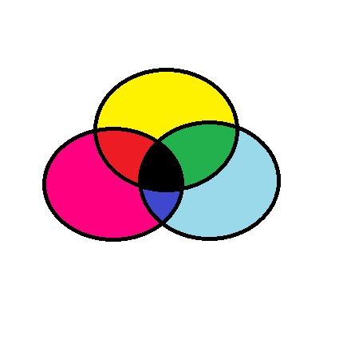
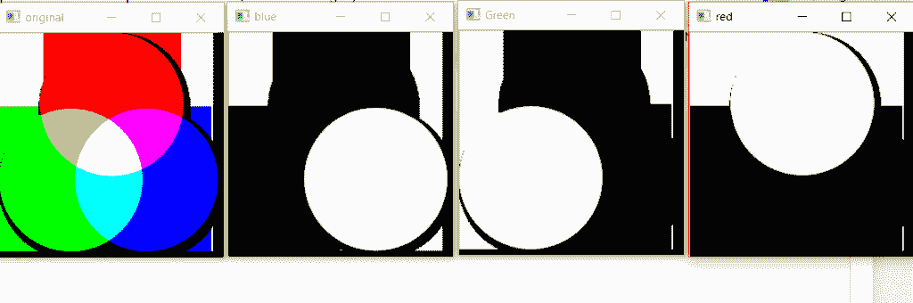

# OpenCV | Python 中的颜色空间

> 原文:[https://www . geesforgeks . org/color-spaces-in-opencv-python/](https://www.geeksforgeeks.org/color-spaces-in-opencv-python/)

**色彩空间**是一种表示图像中呈现的色彩通道的方式，它赋予图像特定的色调。有几种不同的颜色空间，每种都有自己的意义。
一些流行的色彩空间是 *RGB* (红、绿、蓝) *CMYK* (青色、洋红、黄色、黑色) *HSV* (色调、饱和度、值)等。

**BGR 色彩空间:** OpenCV 的默认色彩空间是 RGB。然而，它实际上以 BGR 格式存储颜色。这是一种加色模型，其中蓝色、绿色和红色的不同强度给出不同的颜色深浅。
T3】

**HSV 颜色空间:**它以 RGB 色点的圆柱表示形式存储颜色信息。它试图描绘人眼感知的颜色。色调值在 0-179 之间变化，饱和度值在 0-255 之间变化，值在 0-255 之间变化。它主要用于颜色分割。
T3】

**CMYK 色彩空间:**与 RGB 不同，它是一个减色法色彩空间。CMYK 模型通过在较浅(通常是白色)的背景上部分或全部遮盖颜色来工作。墨水减少了原本会被反射的光线。这种模型被称为减色法，因为墨水从白光中“减去”红色、绿色和蓝色。白光减去红叶青色，白光减去绿叶洋红色，白光减去蓝叶黄色。

**可视化 RGB 图像的不同颜色通道。**

```
import cv2

image = cv2.imread('C://Users//Gfg//rgb.png')
B, G, R = cv2.split(image)
# Corresponding channels are seperated

cv2.imshow("original", image)
cv2.waitKey(0)

cv2.imshow("blue", B)
cv2.waitKey(0)

cv2.imshow("Green", G)
cv2.waitKey(0)

cv2.imshow("red", R)
cv2.waitKey(0)

cv2.destroyAllWindows()
```

**输出:**
