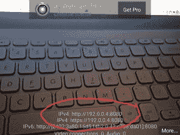
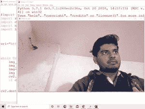

# 将你的安卓手机摄像头连接到 OpenCV–Python

> 原文:[https://www . geesforgeks . org/connect-your-Android-phone-camera-to-opencv-python/](https://www.geeksforgeeks.org/connect-your-android-phone-camera-to-opencv-python/)

**先决条件** : [OpenCV](https://www.geeksforgeeks.org/opencv-python-tutorial/)

**OpenCV** 是一个巨大的开源库，用于计算机视觉、机器学习和图像处理。OpenCV 支持多种编程语言，如 Python、C++、Java 等。它可以处理图像和视频来识别物体、人脸，甚至是人类的笔迹。

很多时候，使用电脑的网络摄像头进行计算机视觉或图像处理并不是一个很好的选择。也许我们想提高我们的网络摄像头的摄像头质量，或者我们想创建一些图像处理应用程序，使用安卓摄像头作为媒介。

本文使用 Windows 来实现这一点。但是代码的基础在其他操作系统上也是一样的。

### 方法

*   在手机上下载安装 [IP 网络摄像头](https://play.google.com/store/apps/details?id=com.pas.webcam&hl=en)应用。
*   然后确保您的电脑和手机都连接到同一个网络。在两侧打开网络摄像头应用程序，点击“启动服务器”(通常位于底部)。这将打开手机上的摄像头。
*   一个网址显示在手机屏幕上，在你的电脑浏览器上输入相同的网址，在“视频渲染器”部分，点击“Javascript”。



*   您可以看到手机上拍摄的视频，这些视频会开始显示在浏览器上。现在，我们要做的是，使用请求模块从网址获取图像数据，并使用 NumPy 将其转换为图像帧，最后，开始使用我们的安卓相机作为 Python 中的网络摄像头。
*   在代码中:
    *   导入模块
    *   添加显示在您手机中的网址
    *   从网址连续获取数据
    *   继续显示收集的数据
    *   关闭窗口

**程序:**

## 蟒蛇 3

```py
# Import essential libraries
import requests
import cv2
import numpy as np
import imutils

# Replace the below URL with your own. Make sure to add "/shot.jpg" at last.
url = "http://192.168.0.103:8080/shot.jpg"

# While loop to continuously fetching data from the Url
while True:
    img_resp = requests.get(url)
    img_arr = np.array(bytearray(img_resp.content), dtype=np.uint8)
    img = cv2.imdecode(img_arr, -1)
    img = imutils.resize(img, width=1000, height=1800)
    cv2.imshow("Android_cam", img)

    # Press Esc key to exit
    if cv2.waitKey(1) == 27:
        break

cv2.destroyAllWindows()
```

**输出:**

