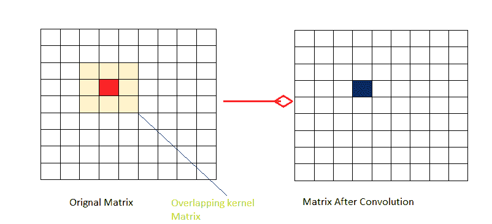
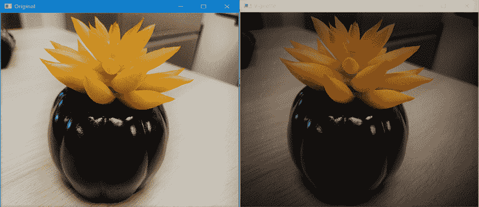

# 使用 Python–OpenCV

创建晕影滤镜

> 原文:[https://www . geeksforgeeks . org/create-a-渐晕-滤镜-使用-python-opencv/](https://www.geeksforgeeks.org/create-a-vignette-filter-using-python-opencv/)

一般来说，计算机中的图像以矩阵的形式存储。在**彩色图像**的情况下，图像以**三维矩阵**的形式表示，或者可以说我们使用三个 2d 矩阵来表示三个颜色通道一个 2d 矩阵表示红色通道，一个表示绿色，一个表示蓝色。在**灰度图像**的情况下，存在单个通道，因此我们使用单个 2d 矩阵来表示灰度图像。

每当我们说**内核或遮罩**时，我们通常指的是一个小尺寸的矩阵，它可以用来在我们的图像上应用效果，例如**模糊**、**压花**、**边缘检测**、**锐化**等，并且逐个像素地应用这些效果的过程被称为**卷积**。



为了想象卷积是如何工作的，让我们考虑大小为 3×3 的**核和大小为 9×9** 的**图像矩阵，如图所示。现在我们在图像矩阵中选择 3×3(与核大小相同)的像素块，并将图像中选择的块与我们的核相乘，然后取和。作为结果获得的总和成为我们的新像素值，该像素值的位置是图中蓝色所示的中心位置。为了获得完整的**滤波图像**，我们在图像矩阵上逐像素滚动核矩阵，并在循环中执行该过程。**

## 什么是渐晕滤镜？

渐晕滤镜通常用于将观众的注意力集中在图像的特定部分，而不会完全隐藏其他部分。一般来说**聚焦部分**有**较高的亮度和饱和度**，亮度和饱和度随着我们从中心到外围径向向外而降低。

## 如何创建和应用过滤器？

因为我们希望保持图像的亮度和饱和度在中心正常，并且当我们从图像的中心径向向外走的时候试图降低这个值，所以我们应该使用一个分配函数，该函数为最近的像素分配比较远的像素更多的权重。这是我们将使用**高斯分布**的主要原因，并且因为我们知道在高斯分布中，大多数值实际上接近于零，没有零。所以我们将创造一个足够大的面具。为了创建二维高斯函数，我们将创建**两个一维高斯函数**并将这两个相乘。一个属于 X 方向，另一个属于 Y 方向。由于我们当前的内核矩阵的大小很大，所以我们将规范化以减少内核大小，否则应用过滤器的成本将会太大。

OpenCV 提供了一个名为 **getGaussianKernel** 的函数，我们将使用它来构建我们的 2D 内核，其大小与图像的大小相匹配。

#### getGaussianKernel 函数

函数的第一个参数，即 **ksize:** 决定内核的大小，我们通常更喜欢奇数，正值。函数的第二个参数，即**σ:**是高斯的标准偏差，它控制明亮中心图像的半径。该函数计算并返回第一个参数中指定大小的矩阵，并包含**高斯滤波器系数**。

```
Mask = (scale size) * (Normalized kernel matrix )
```

创建遮罩后，我们将迭代所有颜色通道，并将遮罩应用于每个通道。缩放是一个重要的步骤，否则所有的像素值接近 0 后，你叠加在图像上的遮罩，图像将看起来是黑色的。

下面是实现。

```
import numpy as np
import cv2

#reading the image 
input_image = cv2.imread('food.jpeg')

#resizing the image according to our need 
# resize() function takes 2 parameters,  
# the image and the dimensions 
input_image = cv2.resize(input_image, (480, 480))

# Extracting the height and width of an image 
rows, cols = input_image.shape[:2]

# generating vignette mask using Gaussian 
# resultant_kernels
X_resultant_kernel = cv2.getGaussianKernel(cols,200)
Y_resultant_kernel = cv2.getGaussianKernel(rows,200)

#generating resultant_kernel matrix 
resultant_kernel = Y_resultant_kernel * X_resultant_kernel.T

#creating mask and normalising by using np.linalg
# function
mask = 255 * resultant_kernel / np.linalg.norm(resultant_kernel)
output = np.copy(input_image)

# applying the mask to each channel in the input image
for i in range(3):
    output[:,:,i] = output[:,:,i] * mask

#displaying the orignal image   
cv2.imshow('Original', input_image)

#displaying the vignette filter image 
cv2.imshow('VIGNETTE', output)

# Maintain output window utill 
# user presses a key 
cv2.waitKey(0)

# Destroying present windows on screen 
cv2.destroyAllWindows() 
```

**输出:**
