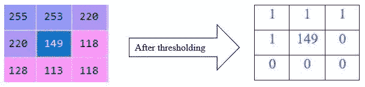
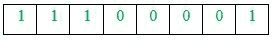
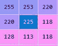
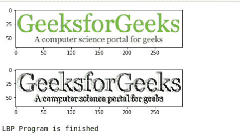

# 使用 OpenCV-Python 创建图像的局部二进制模式

> 原文:[https://www . geesforgeks . org/create-local-binary-pattern-of-a-image-using-opencv-python/](https://www.geeksforgeeks.org/create-local-binary-pattern-of-an-image-using-opencv-python/)

在本文中，我们将讨论图像以及如何使用图像的像素值找到二进制模式。

众所周知，图像也被称为一组像素。当我们将图像存储在计算机中或以数字方式存储时，相应的像素值就会被存储。因此，当我们使用 Python 中的 OpenCV 将图像读入一个变量时，该变量存储图像的像素值。

正如我们在下面的例子中看到的:

```
import cv2
image = cv2.imread("GFG.jpg")

# Now, the variable 'image' stores the pixel values of image
print(image)
```

**示例:**

**输入:
** 
**输出:**

```
[[[255 255 255]
  [255 255 255]
  [255 255 255]
  ...
  [255 255 255]
  [255 255 255]
  [255 255 255]]

 [[255 255 255]
  [255 255 255]
  [255 255 255]
  ...
  [255 255 255]
  [255 255 255]
  [255 255 255]]

 [[255 255 255]
  [255 255 255]
  [255 255 255]
  ...
  [255 255 255]
  [255 255 255]
  [255 255 255]]

 ...

 [[255 255 255]
  [255 255 255]
  [255 255 255]
  ...
  [255 255 255]
  [255 255 255]
  [255 255 255]]

 [[255 255 255]
  [255 255 255]
  [255 255 255]
  ...
  [255 255 255]
  [255 255 255]
  [255 255 255]]

 [[255 255 255]
  [255 255 255]
  [255 255 255]
  ...
  [255 255 255]
  [255 255 255]
  [255 255 255]]]
```

图像的像素值将存储在变量中，下面是存储这些值的 NumPy 数组的一部分。

## 局部二进制模式

有许多不同类型的纹理描述符被用来提取图像的特征。局部二值模式，也称为 LBP，是一种简单且灰度不变的纹理描述子分类方法。在 LBP 中，通过根据中心像素的值将其邻域像素阈值化为 0 或 1，在每个像素生成二进制代码。

查找图像 LBP 的规则如下:

1.  将像素值设置为中心像素。
2.  收集它的邻域像素(这里我取一个 3×3 的矩阵所以；邻域像素总数是 8)
3.  如果邻域像素值大于或等于中心像素值，将其阈值设为 1，否则将其阈值设为 0。
4.  设定阈值后，顺时针或逆时针从邻域收集所有阈值。这个集合会给你一个 8 位数的二进制代码。将二进制代码转换成十进制代码。
5.  用生成的十进制数替换中心像素值，并对图像中的所有像素值进行相同的处理。

让我们举个例子来正确理解它。

让我们从上面的输出中获取一个像素值，从它的局部邻域中找到它的二进制模式。因此，我取值‘149’(出现在第 15 行和第 19 列)及其 8 个相邻像素，形成一个 3×3 矩阵。



顺时针或逆时针收集阈值。在这里，我从左上角顺时针方向收集它们。因此，收集后，二进制值将如下所示:



然后，将二进制代码转换为十进制代码，并将其放在矩阵的中心。

```
1 x 27 + 1 x 26 + 1 x 25 + 0 x 24 + 0 x 23 + 0 x 22 + 0 x 21 +1 x 20 
= 128 + 64 + 32 + 0 + 0 + 0 + 0 + 1
= 225
```

现在，生成的矩阵看起来像，



现在，让我们使用 python 来实现它

```
import cv2
import numpy as np
from matplotlib import pyplot as plt

def get_pixel(img, center, x, y):

    new_value = 0

    try:
        # If local neighbourhood pixel 
        # value is greater than or equal
        # to center pixel values then 
        # set it to 1
        if img[x][y] >= center:
            new_value = 1

    except:
        # Exception is required when 
        # neighbourhood value of a center
        # pixel value is null i.e. values
        # present at boundaries.
        pass

    return new_value

# Function for calculating LBP
def lbp_calculated_pixel(img, x, y):

    center = img[x][y]

    val_ar = []

    # top_left
    val_ar.append(get_pixel(img, center, x-1, y-1))

    # top
    val_ar.append(get_pixel(img, center, x-1, y))

    # top_right
    val_ar.append(get_pixel(img, center, x-1, y + 1))

    # right
    val_ar.append(get_pixel(img, center, x, y + 1))

    # bottom_right
    val_ar.append(get_pixel(img, center, x + 1, y + 1))

    # bottom
    val_ar.append(get_pixel(img, center, x + 1, y))

    # bottom_left
    val_ar.append(get_pixel(img, center, x + 1, y-1))

    # left
    val_ar.append(get_pixel(img, center, x, y-1))

    # Now, we need to convert binary
    # values to decimal
    power_val = [1, 2, 4, 8, 16, 32, 64, 128]

    val = 0

    for i in range(len(val_ar)):
        val += val_ar[i] * power_val[i]

    return val

path = 'GFG.png'
img_bgr = cv2.imread(path, 1)

height, width, _ = img_bgr.shape

# We need to convert RGB image 
# into gray one because gray 
# image has one channel only.
img_gray = cv2.cvtColor(img_bgr,
                        cv2.COLOR_BGR2GRAY)

# Create a numpy array as 
# the same height and width 
# of RGB image
img_lbp = np.zeros((height, width),
                   np.uint8)

for i in range(0, height):
    for j in range(0, width):
        img_lbp[i, j] = lbp_calculated_pixel(img_gray, i, j)

plt.imshow(img_bgr)
plt.show()

plt.imshow(img_lbp, cmap ="gray")
plt.show()

print("LBP Program is finished")
```

**输出:**



示例中显示的输出包含 X 轴和 Y 轴的一些值，分别指输入图像的宽度和高度。