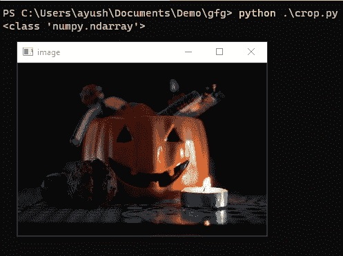
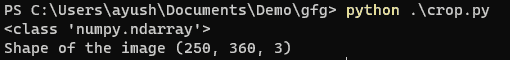
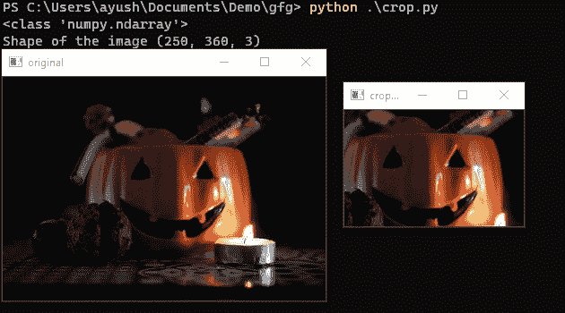

# 使用 OpenCV-Python 裁剪图像

> 原文:[https://www . geesforgeks . org/crop-image-with-opencv-python/](https://www.geeksforgeeks.org/crop-image-with-opencv-python/)

裁剪图像是我们在项目中执行的最基本的图像操作之一。在本文中，我们将讨论如何在 Python 中使用 OpenCV 裁剪图像。

## 逐步实施

为此，我们将拍摄下图。


### **第一步:读取图像**

[cv2.imread()](https://www.geeksforgeeks.org/python-opencv-cv2-imread-method/) 方法从指定文件加载图像。如果无法读取图像(因为缺少文件、权限不当、格式不受支持或无效)，则此方法返回一个空矩阵。

**注意:**当我们使用 **cv2.imread()** 在 OpenCV 中加载图像时，我们将其存储为 **Numpy n 维数组。**

**示例:** Python 程序读取图像

## 蟒蛇 3

```py
import cv2

# Read Input Image
img = cv2.imread("test.jpeg")

# Check the type of read image
print(type(img))

# Display the image
cv2.imshow('image', img)
cv2.waitKey(0)
cv2.destroyAllWindows()
```

**输出**:



### **第二步:获取图像尺寸**

我们可以看到“ **img** 的类型为“ **numpy.ndarray** ”。现在，我们简单地将数组切片应用到我们的 NumPy 数组，并生成我们的裁剪图像，因此我们必须找到图像的维度。为此，我们将使用 image.shape 属性。

**语法:**

```py
image.shape
```

其中图像是输入图像

**示例:** Python 代码查找图像的维度，

## 蟒蛇 3

```py
import cv2

# read the image
img = cv2.imread("test.jpeg")
print(type(img))

# Check the shape of the input image
print("Shape of the image", img.shape)
```

**输出**:



图像形状

### 第三步:切片图像

现在我们可以应用数组切片来产生最终结果。

**语法:**

```py
image[rows,columns]
```

在哪里

1.  行是行切片
2.  列是列切片

**示例:**

## 蟒蛇 3

```py
import cv2

img = cv2.imread("test.jpeg")
print(type(img))

# Shape of the image
print("Shape of the image", img.shape)

# [rows, columns]
crop = img[50:180, 100:300]  

cv2.imshow('original', img)
cv2.imshow('cropped', crop)
cv2.waitKey(0)
cv2.destroyAllWindows()
```

**输出**:

