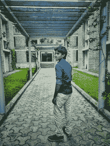
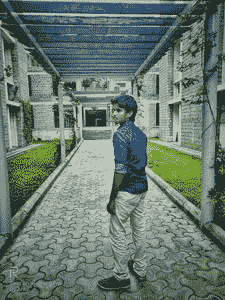
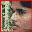

# 使用 OpenCV–Python 从图像中裁剪人脸

> 原文:[https://www . geeksforgeeks . org/clipping-face-from-images-use-opencv-python/](https://www.geeksforgeeks.org/cropping-faces-from-images-using-opencv-python/)

Opencv 是一个 python 库，主要用于图像处理和计算机视觉。在本文中，我们首先检测人脸，然后从图像中裁剪人脸。人脸检测是图像处理的一个分支，用于检测人脸。

我们将使用预先训练的哈尔级联模型从图像中检测人脸。A [哈尔级联](https://docs.opencv.org/3.4.3/d7/d8b/tutorial_py_face_detection.html)是用于从图像中检测物体的物体检测方法。该算法由大量图像训练而成。点击[这里](http://alereimondo.no-ip.org/OpenCV/uploads/34/frontalFace10.zip)可以下载人脸哈尔级联文件。

**让我们逐步实现:**

**第一步:**在这一步中，我们将读取图像并将其转换为灰度。

## 蟒蛇 3

```
import cv2

# Read the input image
img = cv2.imread('mpw.jpeg')

# Convert into grayscale
gray = cv2.cvtColor(img, cv2.COLOR_BGR2GRAY)
```

**解释:**在这段代码中，我们首先使用 import cv2 导入我们的 opencv 库。cv2.imread()方法从给定路径(例如:mpw.jpeg 或 filepath/mpw.jpeg)加载图像后，我们使用 COLOR_BGR2GRAY 将图像转换为灰度图像。

**步骤 2:** 使用哈尔级联模型从图像中检测人脸。

## 蟒蛇 3

```
face_cascade = cv2.CascadeClassifier('haarcascade_frontalface_alt2.xml')

# Detect faces
faces = face_cascade.detectMultiScale(gray, 1.1, 4)
```

**说明:**我们用 cv2。用于在 face_cascade 中加载 haarcascade 文件的级联分类器。检测多尺度()函数用于检测人脸。它需要 3 个参数:

*   灰度:输入图像(灰度图像)
*   1.1:比例因子，它指定图像大小随每个比例减少多少。它提高了检测能力。
*   4: MinNeighbours，指定每个候选矩形应该保留多少个邻居。

**第三步:**找到图像中的人脸。

## 蟒蛇 3

```
for (x, y, w, h) in faces:
    cv2.rectangle(img, (x, y), (x+w, y+h), 
                  (0, 0, 255), 2)

    faces = img[y:y + h, x:x + w]
    cv2.imshow("face",faces)
    cv2.imwrite('face.jpg', faces)

cv2.imshow('img', img)
cv2.waitKey()
```

**说明:** x、y 为人脸的像素位置，w、h 为人脸的宽度和高度。cv2.rectangle()函数用于在检测到的对象上绘制矩形，img 是输入图像，(x，y)，(x+w，y+h)是矩形的位置，(0，0，255)是矩形的颜色这个参数作为元组传递给 BGR，我们将使用(0，0，255)表示红色，2 是矩形的厚度。

**以下是完整实现:**

**使用的图像–**



**输入图像**

## 蟒蛇 3

```
import cv2

# Read the input image
img = cv2.imread('mpw.jpeg')

# Convert into grayscale
gray = cv2.cvtColor(img, cv2.COLOR_BGR2GRAY)

# Load the cascade
face_cascade = cv2.CascadeClassifier('haarcascade_frontalface_alt2.xml')

# Detect faces
faces = face_cascade.detectMultiScale(gray, 1.1, 4)

# Draw rectangle around the faces and crop the faces
for (x, y, w, h) in faces:
    cv2.rectangle(img, (x, y), (x+w, y+h), (0, 0, 255), 2)
    faces = img[y:y + h, x:x + w]
    cv2.imshow("face",faces)
    cv2.imwrite('face.jpg', faces)

# Display the output
cv2.imwrite('detcted.jpg', img)
cv2.imshow('img', img)
cv2.waitKey()
```

**输出:**



**检测到的人脸**



**裁剪图像**