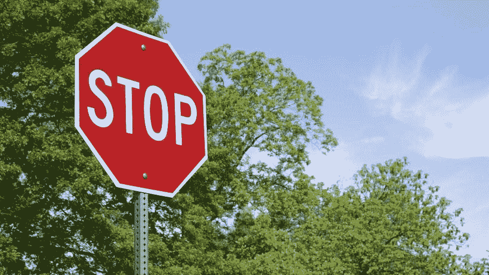
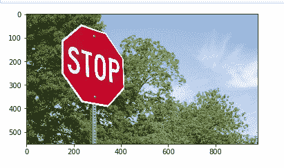
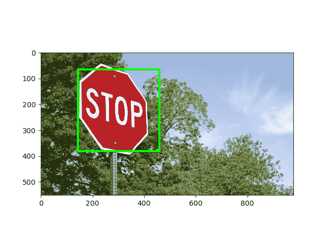

# 用 OpenCV-Python 检测对象

> 原文:[https://www . geesforgeks . org/detect-an-object-with-opencv-python/](https://www.geeksforgeeks.org/detect-an-object-with-opencv-python/)

OpenCV 是用于计算机视觉、机器学习和图像处理的巨大开源库，现在它在实时操作中发挥着重要作用，这在当今的系统中非常重要。通过使用它，人们可以处理图像和视频来识别物体、人脸，甚至是人类的笔迹。本文着重于检测对象。

**注:**详见[OpenCV 介绍](https://www.geeksforgeeks.org/introduction-to-opencv/)。

#### 目标检测

对象检测是一种与计算机视觉、图像处理和深度学习相关的计算机技术，用于检测图像和视频中的对象实例。在本文中，我们将使用被称为**哈尔级联**的东西来进行物体检测。

#### 瀑布式头发

哈尔级联分类器是一种有效的目标检测方法。这种方法是由保罗·维奥拉和迈克尔·琼斯在他们的论文[中提出的，利用简单特征的增强级联](https://www.researchgate.net/publication/3940582_Rapid_Object_Detection_using_a_Boosted_Cascade_of_Simple_Features)快速检测目标。哈尔级联是一种基于机器学习的方法，其中使用大量的正图像和负图像来训练分类器。

*   **正面图像–**这些图像包含我们希望分类器识别的图像。
*   **负像–**其他一切的像，不包含我们想要检测的物体。
    要求。

**下载要求的步骤如下:**

*   在终端运行以下命令安装 opencv。

    ```py
    pip install opencv-python

    ```

*   运行以下命令在终端安装 matplotlib。

    ```py
    pip install matplotlib

    ```

*   要将下面代码中使用的哈尔级联文件和图像作为 zip 文件下载，请单击此处的。

**注意:**将 XML 文件和 PNG 图像放在与 Python 脚本相同的文件夹中。

#### 履行

**使用的图像:**



**打开图像**

```py
import cv2
from matplotlib import pyplot as plt

# Opening image
img = cv2.imread("image.jpg")

# OpenCV opens images as BRG 
# but we want it as RGB and 
# we also need a grayscale 
# version
img_gray = cv2.cvtColor(img, cv2.COLOR_BGR2GRAY)
img_rgb = cv2.cvtColor(img, cv2.COLOR_BGR2RGB)

# Creates the environment 
# of the picture and shows it
plt.subplot(1, 1, 1)
plt.imshow(img_rgb)
plt.show()
```

**输出:**



**识别**

我们将使用 OpenCV 的`detectMultiScale()`功能来识别大标志和小标志:

```py
# Use minSize because for not 
# bothering with extra-small 
# dots that would look like STOP signs
found = stop_data.detectMultiScale(img_gray, 
                                   minSize =(20, 20))

# Don't do anything if there's 
# no sign
amount_found = len(found)

if amount_found != 0:

    # There may be more than one
    # sign in the image
    for (x, y, width, height) in found:

        # We draw a green rectangle around
        # every recognized sign
        cv2.rectangle(img_rgb, (x, y), 
                      (x + height, y + width), 
                      (0, 255, 0), 5)
```

**以下是懒人开发者的完整脚本:**

```py
import cv2
from matplotlib import pyplot as plt

# Opening image
img = cv2.imread("image.jpg")

# OpenCV opens images as BRG 
# but we want it as RGB We'll 
# also need a grayscale version
img_gray = cv2.cvtColor(img, cv2.COLOR_BGR2GRAY)
img_rgb = cv2.cvtColor(img, cv2.COLOR_BGR2RGB)

# Use minSize because for not 
# bothering with extra-small 
# dots that would look like STOP signs
stop_data = cv2.CascadeClassifier('stop_data.xml')

found = stop_data.detectMultiScale(img_gray, 
                                   minSize =(20, 20))

# Don't do anything if there's 
# no sign
amount_found = len(found)

if amount_found != 0:

    # There may be more than one
    # sign in the image
    for (x, y, width, height) in found:

        # We draw a green rectangle around
        # every recognized sign
        cv2.rectangle(img_rgb, (x, y), 
                      (x + height, y + width), 
                      (0, 255, 0), 5)

# Creates the environment of 
# the picture and shows it
plt.subplot(1, 1, 1)
plt.imshow(img_rgb)
plt.show()
```

**输出:**

