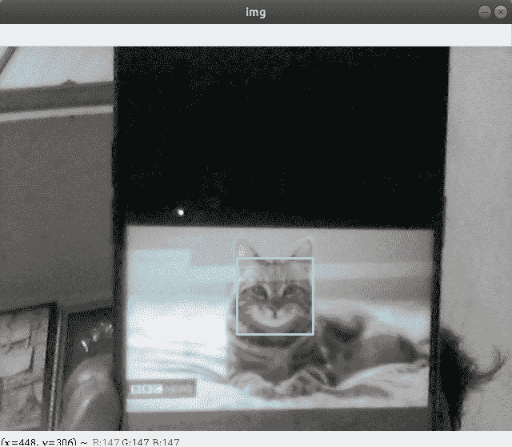

# 使用 Python-OpenCV 实时检测猫脸

> 原文:[https://www . geesforgeks . org/detect-cat-face-in-time-use-python-opencv/](https://www.geeksforgeeks.org/detect-cat-faces-in-real-time-using-python-opencv/)

**[人脸检测](https://www.geeksforgeeks.org/opencv-python-program-face-detection/)** 是一种从图像中识别人脸的技术。我们为此使用 Python 的 OpenCV。我们也可以在动物的情况下使用人脸检测。如果可以仔细查看 OpenCV 存储库，haar 级联目录是特定的(OpenCV 在这里存储其所有预先训练的 haar 分类器，以检测各种对象、身体部位等。)，有两个文件:

*   haarcascade _ frontalcatface . xml
*   haarcscade _ frontal catface _ extended . XML

给定程序的目标是实时检测感兴趣的对象(猫脸)，并保持跟踪同一对象。这是一个如何在 Python 中检测猫脸的简单例子。您可以尝试使用您选择的任何其他对象的训练样本，通过在所需对象上训练分类器来进行检测。

下面是实现。

```
# OpenCV program to detect cat face in real time 
# import libraries of python OpenCV 
# where its functionality resides 
import cv2 

# load the required trained XML classifiers 
# https://github.com/Itseez/opencv/blob/master/ 
# data/haarcascades/haarcascade_frontalcatface.xml 
# Trained XML classifiers describes some features of some 
# object we want to detect a cascade function is trained 
# from a lot of positive(faces) and negative(non-faces) 
# images. 
face_cascade = cv2.CascadeClassifier('haarcascade_frontalcatface.xml') 

# capture frames from a camera 
cap = cv2.VideoCapture(0) 

# loop runs if capturing has been initialized. 
while 1: 

    # reads frames from a camera 
    ret, img = cap.read() 

    # convert to gray scale of each frames 
    gray = cv2.cvtColor(img, cv2.COLOR_BGR2GRAY) 

    # Detects faces of different sizes in the input image 
    faces = face_cascade.detectMultiScale(gray, 1.3, 5) 

    for (x,y,w,h) in faces: 
        # To draw a rectangle in a face 
        cv2.rectangle(img,(x,y),(x+w,y+h),(255,255,0),2) 
        roi_gray = gray[y:y+h, x:x+w] 
        roi_color = img[y:y+h, x:x+w] 

    # Display an image in a window 
    cv2.imshow('img',img) 

    # Wait for Esc key to stop 
    k = cv2.waitKey(30) & 0xff
    if k == 27: 
        break

# Close the window 
cap.release() 

# De-allocate any associated memory usage 
cv2.destroyAllWindows() 
```

**输出:**

