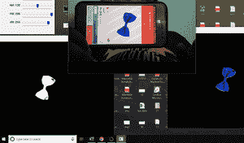

# 使用 OpenCV

检测 Python 中颜色相似的对象

> 原文:[https://www . geesforgeks . org/detecting-python 中颜色相似的对象-使用-opencv/](https://www.geeksforgeeks.org/detecting-objects-of-similar-color-in-python-using-opencv/)

[**OpenCV**](https://www.geeksforgeeks.org/opencv-python-tutorial/) 是一个主要针对实时计算机视觉的编程函数库。

在本文中，我们将看到如何在一个图像中获得的对象相同的颜色。我们可以通过由 cv2 命令 cv2.createTrackbar. 创建的滑杆来选择颜色

#### **所需库:**

```
OpenCV
Numpy
```

#### 进场:

首先、我们需要使用 cv2.imread()读取本地文件夹中的图像。为了过滤特定的颜色我们需要将图像转换为  HSV 格式，即色相、 【饱和度】、和数值，并使用 cv2.inRange()通过提供我们想要过滤的 RGB 值的下限和上限来屏蔽图像，这给我们一个黑白图像，其中具有我们的兴趣颜色的图像为白色，其余为黑色。我们可以通过执行 cv2 按位 _and 运算来返回我们通过 trackbar 给它的指定颜色的图像。

**代码:**

## 蟒蛇 3

```
# import required library
import cv2
import numpy as np
import matplotlib.pyplot as plt

# create a video object
# for capture the frames.
# for Webcamera we pass 0 
# as an argument 
cap = cv2.VideoCapture(0)

# define a empty function 
def nothing(x):
    pass

# set windown name
cv2.namedWindow('Tracking')

# Creates a trackbar and attaches 
# it to the specified window 
# with nothing function
cv2.createTrackbar("LH", "Tracking",
                   0, 255, nothing)
cv2.createTrackbar("LS", "Tracking", 
                   0, 255, nothing)
cv2.createTrackbar("LV", "Tracking", 
                   0, 255, nothing)
cv2.createTrackbar("HH", "Tracking", 
                   0, 255, nothing)
cv2.createTrackbar("HS", "Tracking", 
                   0, 255, nothing)
cv2.createTrackbar("HV", "Tracking",
                   0, 255, nothing)

# This drives the program 
# into an infinite loop. 
while True:

    # Captures the live stream frame-by-frame
    _, frame = cap.read()

    # Converts images from BGR to HSV 
    hsv = cv2.cvtColor(frame, 
                       cv2.COLOR_BGR2HSV)

    # find LH trackbar position
    l_h = cv2.getTrackbarPos("LH",
                             "Tracking")
    # find LS trackbar position
    l_s = cv2.getTrackbarPos("LS",
                             "Tracking")
    # find LV trackbar position
    l_v = cv2.getTrackbarPos("LV", 
                             "Tracking")
    # find HH trackbar position
    h_h = cv2.getTrackbarPos("HH", 
                             "Tracking")
    # find HS trackbar position
    h_s = cv2.getTrackbarPos("HS",
                             "Tracking")
    # find HV trackbar position
    h_v = cv2.getTrackbarPos("HV",
                             "Tracking")
    # create a given numpy array
    l_b = np.array([l_h, l_s,
                    l_v])
    # create a given numpy array
    u_b = np.array([h_h, h_s,
                    h_v])
    # create a mask
    mask = cv2.inRange(hsv, l_b,
                       u_b)
    # applying bitwise_and operation
    res = cv2.bitwise_and(frame, 
                          frame, mask = mask)

    # display frame, mask
    # and res window
    cv2.imshow('frame', frame)
    cv2.imshow('mask', mask)
    cv2.imshow('res', res)

    # wait for 1 sec
    k =  cv2.waitKey(1)

    # break out of while loop
    # if k value is 27
    if k == 27:
        break

# release the captured frames 
cap.release()

# Destroys all windows. 
cv2.destroyAllWindows()
```

**输出:**

