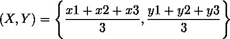

# 用 OpenCV

画一个带质心的三角形

> 原文:[https://www . geeksforgeeks . org/用-opencv/](https://www.geeksforgeeks.org/draw-a-triangle-with-centroid-using-opencv/) 画一个带质心的三角形

**先决条件:** [使用 OpenCV 的几何形状](https://www.geeksforgeeks.org/draw-geometric-shapes-images-using-opencv/)

给定一个三角形的三个顶点，编写一个 Python 程序来找到三角形的质心，然后使用 OpenCV 在一个黑色的窗口上画出三角形的质心。

**示例:**

```
Input: (100, 200) (50, 50) (300, 100)
Output: (150, 116)

```

**所需的库:**

```
OpenCV
Numpy

```

**逼近:**
创建一个分辨率为 400 x 300 的三色通道的黑色窗口。使用 OpenCV 的内置直线函数绘制三条穿过给定点的直线。它将在黑色窗口上创建一个三角形。用下面的简单公式求出三角形的质心。



使用零厚度的 OpenCV 的*圆*功能在黑色窗口上画出这个质心。

下面是上述方法的实现:

```
# Python3 code to draw a triangle and find centroid

# importing libraries
import numpy as np
import cv2

# Width and height of the black window 
width = 400
height = 300

# Create a black window of 400 x 300
img = np.zeros((height, width, 3), np.uint8)

# Three vertices(tuples) of the triangle 
p1 = (100, 200)
p2 = (50, 50)
p3 = (300, 100)

# Drawing the triangle with the help of lines
#  on the black window With given points 
# cv2.line is the inbuilt function in opencv library
cv2.line(img, p1, p2, (255, 0, 0), 3)
cv2.line(img, p2, p3, (255, 0, 0), 3)
cv2.line(img, p1, p3, (255, 0, 0), 3)

# finding centroid using the following formula
# (X, Y) = (x1 + x2 + x3//3, y1 + y2 + y3//3) 
centroid = ((p1[0]+p2[0]+p3[0])//3, (p1[1]+p2[1]+p3[1])//3)

# Drawing the centroid on the window  
cv2.circle(img, centroid, 4, (0, 255, 0))

# image is the title of the window
cv2.imshow("image", img)
cv2.waitKey(0)
```

**输出:**

```
(150, 116)

```

