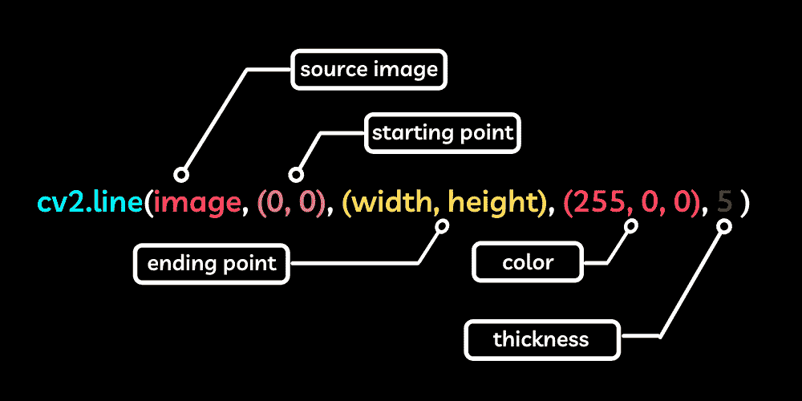
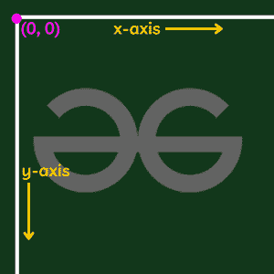

# 用 OpenCV 在图像上画十字

> 原文:[https://www . geesforgeks . org/drawing-a-cross-on-a-image-with-opencv/](https://www.geeksforgeeks.org/drawing-a-cross-on-an-image-with-opencv/)

在本文中，我们将讨论如何使用 OpenCV-Python 在图像上绘制十字。我们可以画一个重叠的两条线，在图像上画一个十字。

要在 OpenCV 上画线，使用下面的函数。

> **语法:** cv2.line(图像、起点、终点、颜色、厚度)
> 
> **参数:**
> 
> *   图像–需要在其上绘制形状的源图像。
> *   起点–线条应该开始的图像坐标。它由一组坐标(x 轴、y 轴)表示，基本上是像素从哪里开始的位置。
> *   ending point–线条应该结束的图像坐标。其由坐标元组(x 轴、y 轴)表示。
> *   颜色–在图像上绘制的线条的颜色。由元组上的 BGR 颜色值表示，其中每个值都在 0–255 之间
>     *   (255，0，0)代表蓝色
>     *   (0，255，0)表示绿色
>     *   (0，0，255)表示红色]
> *   厚度–绘制线条的厚度，以像素为单位。



要在图像上画十字，我们首先需要导入必要的库，

*   [OpenCV](https://www.geeksforgeeks.org/opencv-overview/)
*   num py

然后读取要在其上绘制形状的图像，然后调用 OpenCV 上的 line 函数，在 x 轴和 y 轴的给定坐标上绘制一条线，这两个坐标基本上是图像上像素的开始和结束位置。在 OpenCV 中，由于某种原因，x 和 y 平面与我们使用的正常笛卡尔平面是直线相反的。其中 x 轴位于图像的顶部边缘，y 轴位于图像的左侧边缘，但上下颠倒，这意味着 x 轴的增加意味着向图像的右侧移动，y 轴的增加意味着向下移动图像。



为了得到图像的宽度和高度，我们需要在 OpenCV 中调用一个简单的函数，这个函数将返回图像的形状，从这个函数中，我们可以得到图像的宽度和高度，我们可以在程序中使用它。只需调用。形状方法来获得尺寸。

在图像上画十字的程序，

## 蟒蛇 3

```
# Importing the necessary libraries
import cv2
import numpy

# Reading the image
image = cv2.imread('image.png')

# Getting the height and width of the image
height = image.shape[0]
width = image.shape[1]

# Drawing the lines
cv2.line(image, (0, 0), (width, height), (0, 0, 255), 5)
cv2.line(image, (width, 0), (0, height), (0, 0, 255), 5)

# Showing the image
cv2.imshow('image', image)

cv2.waitKey(0)
cv2.destroyAllWindows()
```