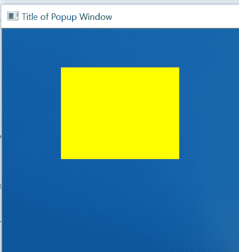

# 使用 Python-OpenCV 在图像上用鼠标绘图

> 原文:[https://www . geesforgeks . org/用鼠标在图像上绘图-使用-python-opencv/](https://www.geeksforgeeks.org/drawing-with-mouse-on-images-using-python-opencv/)

[OpenCV](https://www.geeksforgeeks.org/opencv-python-tutorial/) 是一个巨大的开源库，用于计算机视觉、机器学习和图像处理。OpenCV 支持多种编程语言，如 Python、C++、Java 等。它可以处理图像和视频来识别物体、人脸，甚至是人类的笔迹。在本文中，我们将尝试在鼠标的帮助下绘制图像。在学习如何使用鼠标绘制图像之前，我们需要了解什么是回调。<

### 回收

编程中的回调意味着当进程完成时调用这个函数(回调)。这同样适用于面向事件的编程。单击鼠标按钮(事件)时，调用函数。我们不知道按钮什么时候会被点击。我们所能做的就是告诉按钮“给我回电话”，或者在点击鼠标按钮时调用这个函数。

### 鼠标回调

当用户使用鼠标执行操作时，可能会发生回调；这种操作通常被称为事件。一个鼠标只存在一个回调，就是 **setMouseCallback()** ，所有鼠标操作都只会调用这个函数。

**我们可以有条件块来基于使用鼠标执行的事件/操作来执行一些事情。鼠标事件/操作可以是:**

*   event _ mousemove
*   *事件 _ 关闭按钮*
*   *事件 _RBUTTONDOWN*
*   event _ lbuttonup
*   *事件 _RBUTTONUP*

**这种回调应该在什么时候发生:**

只有在弹出窗口上使用鼠标时，我们才希望有这个回调，弹出窗口的标题为**“弹出窗口的标题。”**

```
cv2.namedWindow("Title of Popup Window")

```

**示例 1:** **当我们用 OpenCV 左键单击弹出菜单时，绘制圆形:**

```
import cv2

img = cv2.imread("flower.jpg")

def draw_circle(event, x, y, flags, param):

    if event == cv2.EVENT_LBUTTONDOWN:
        print("hello")
        cv2.circle(img, (x, y), 100, (0, 255, 0), -1)

cv2.namedWindow(winname = "Title of Popup Window")
cv2.setMouseCallback("Title of Popup Window", draw_circle)

while True:
    cv2.imshow("Title of Popup Window", img)

    if cv2.waitKey(10) & 0xFF == 27:
        break

cv2.destroyAllWindows()
```

**输出:**


**示例 2:** **使用 OpenCV** 拖动图像绘制矩形

```
import cv2

img = cv2.imread("flower.jpg")

# variables
ix = -1
iy = -1
drawing = False

def draw_rectangle_with_drag(event, x, y, flags, param):

    global ix, iy, drawing, img

    if event == cv2.EVENT_LBUTTONDOWN:
        drawing = True
        ix = x
        iy = y            

    elif event == cv2.EVENT_MOUSEMOVE:
        if drawing == True:
            cv2.rectangle(img, pt1 =(ix, iy),
                          pt2 =(x, y),
                          color =(0, 255, 255),
                          thickness =-1)

    elif event == cv2.EVENT_LBUTTONUP:
        drawing = False
        cv2.rectangle(img, pt1 =(ix, iy),
                      pt2 =(x, y),
                      color =(0, 255, 255),
                      thickness =-1)

cv2.namedWindow(winname = "Title of Popup Window")
cv2.setMouseCallback("Title of Popup Window", 
                     draw_rectangle_with_drag)

while True:
    cv2.imshow("Title of Popup Window", img)

    if cv2.waitKey(10) == 27:
        break

cv2.destroyAllWindows()
```

**输出:**



### (cv2.waitKey(10) & 0xFF == 27)是做什么的？

cv2.waitKey()返回一个 32 位整数值(可能取决于平台)。键输入是 ASCII，它是一个 8 位整数值。所以你只关心这 8 位，希望所有其他位都是 0。这个你可以用:`cv2.waitKey(10) & 0xFF == 27`来实现